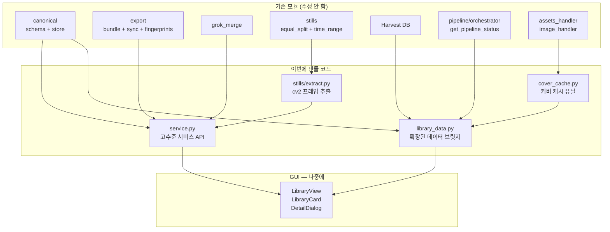

# 라이브러리 뷰 구현 계획 (백엔드/서비스 레이어)

> **범위**: GUI 위젯(PyQt) 코드는 이번 구현에서 **제외**. 모든 GUI 모듈을 한꺼번에 작업할 때 별도 진행한다.
> 이번에는 GUI가 나중에 **import해서 호출만 하면 되는** 데이터/서비스 계층만 만든다.

---

## 현재 상태 진단

### 이미 있는 것 (건드리지 않음)

- [javstory_library/canonical/](javstory_library/canonical/) -- `LibraryCanonical` 스키마, `load_library_state`/`save_library_state`
- [javstory_library/export/](javstory_library/export/) -- `export_canonical_bundle`, fingerprints, sync, master_js, story_export
- [javstory_library/grok_merge/merge.py](javstory_library/grok_merge/merge.py) -- `merge_grok_draft` (잠금 필드 존중 병합)
- [javstory_library/stills/equal_split.py](javstory_library/stills/equal_split.py) -- 구간 내 균등 시각 **계산만**
- [javstory_library/stills/time_range.py](javstory_library/stills/time_range.py) -- `time_range` 문자열 파싱
- [javstory_library/multipart/](javstory_library/multipart/) -- 파트 정렬, 합산 SRT
- [Harvest/database.py](Harvest/database.py) -- `JAVMetadata` 모델, `get_db_session`
- [pipeline/orchestrator.py](pipeline/orchestrator.py) -- `get_pipeline_status` (Harvest/STT/자막 산출물 존재 판정)
- [core/assets_handler.py](core/assets_handler.py) -- 커버 httpx async 다운로드
- [core/image_handler.py](core/image_handler.py) -- poster/thumb urllib 다운로드

### 빠져 있는 것 (이번에 구현)

| 부재 | 설명 |
|------|------|
| **스틸 프레임 추출** | `equal_split`은 시각만 계산. 실제 영상에서 cv2로 프레임을 뽑아 저장하는 코드 없음 |
| **라이브러리 서비스** | 씬 편집→저장, Grok 재실행→병합, export 트리거, drift 검사, 스틸 새로고침 등을 하나로 묶는 고수준 API 없음 |
| **데이터 브릿지 확장** | `LibraryWorkSummary`에 파이프라인 상태, 커버 폴백 경로, 정렬 키가 없음 |
| **커버 캐시 통합** | `assets_handler`/`image_handler`가 있지만 라이브러리 경로 체계와 연결 안 됨 |

---

## 아키텍처



---

## 1. `javstory_library/stills/extract.py` — 스틸 프레임 추출

**역할**: 영상 파일 경로 + 시각 목록 -> 지정 디렉터리에 JPEG 프레임 저장.

**핵심 함수**:

```python
def extract_frames(
    video_path: Path,
    timestamps_sec: list[float],
    output_dir: Path,
    *,
    prefix: str = "still",
    quality: int = 95,
) -> list[Path]:
    """cv2.VideoCapture로 각 timestamp에서 프레임을 뽑아 JPEG 저장. 경로 리스트 반환."""
```

```python
def extract_stills_for_scene(
    video_path: Path,
    scene: SceneEntry,
    stills_base_dir: Path,
    *,
    n_stills: int = 3,
    min_gap_sec: float = 0.5,
) -> list[str]:
    """
    scene.start_sec/end_sec -> equal_split_seconds -> extract_frames.
    scene.still_paths에 넣을 상대 경로 리스트 반환.
    scene.needs_still_refresh를 False로 바꿔야 하는지는 호출측이 결정.
    """
```

```python
def refresh_all_stills(
    video_path: Path,
    state: LibraryCanonical,
    *,
    n_per_scene: int = 3,
    only_needs_refresh: bool = True,
) -> LibraryCanonical:
    """
    needs_still_refresh=True인 씬만(또는 전부) 스틸 재추출 후
    still_paths 갱신 + needs_still_refresh=False 설정한 새 state 반환.
    """
```

**의존**: `cv2` (`opencv-python`), [equal_split.py](javstory_library/stills/equal_split.py), [paths.py](javstory_library/paths.py)의 `stills_dir`

**에지 케이스**:
- `start_sec`/`end_sec`가 None -> 스킵, 로그 경고
- 영상 열기 실패 -> `FileNotFoundError` 또는 빈 리스트 + 로그
- 아주 짧은 구간 -> `equal_split_seconds`가 이미 처리 (1점만 반환)

---

## 2. `javstory_library/service.py` — 라이브러리 서비스 API

GUI가 **단일 import**로 모든 라이브러리 작업을 수행할 수 있는 **파사드**. 내부에서 canonical/export/grok_merge/stills 모듈을 조합한다.

### 2-1. 씬 편집 + 저장

```python
def load_work(product_code: str) -> LibraryCanonical | None:
    """library_state.json 로드. 없으면 None."""

def save_work(state: LibraryCanonical) -> Path:
    """canonical 저장 (touch + atomic write). 저장된 경로 반환."""

def update_scene(
    state: LibraryCanonical,
    scene_id: str,
    updates: dict[str, Any],
    *,
    lock_updated_fields: bool = False,
) -> LibraryCanonical:
    """
    씬 하나의 필드를 수정한 새 state 반환.
    time_range가 바뀌면 자동으로 start_sec/end_sec 재파싱 + needs_still_refresh=True.
    lock_updated_fields=True이면 수정된 키를 locked_fields에 추가.
    """

def toggle_scene_lock(
    state: LibraryCanonical,
    scene_id: str,
    field: str,
) -> LibraryCanonical:
    """필드를 locked_fields에 추가/제거 토글한 새 state 반환."""

def toggle_work_lock(
    state: LibraryCanonical,
    field: str,
) -> LibraryCanonical:
    """work_locked_fields에 추가/제거 토글."""
```

### 2-2. Grok 병합

```python
def merge_grok_into_work(
    state: LibraryCanonical,
    grok_dict: dict[str, Any],
) -> LibraryCanonical:
    """merge_grok_draft 래퍼. 잠긴 필드 보호. 새 state 반환."""
```

### 2-3. Export

```python
def run_export(
    state: LibraryCanonical,
    project_root: Path,
    *,
    video_src: str = "",
    video_duration: float = 0.0,
) -> LibraryCanonical:
    """export_canonical_bundle 래퍼. export_manifest가 채워진 새 state 반환."""

def check_export_drift(
    state: LibraryCanonical,
    project_root: Path,
) -> list[ExportDrift]:
    """list_export_drift 래퍼."""
```

### 2-4. 스틸 새로고침

```python
def refresh_stills(
    state: LibraryCanonical,
    video_path: Path,
    *,
    n_per_scene: int = 3,
    only_dirty: bool = True,
) -> LibraryCanonical:
    """extract.refresh_all_stills 래퍼. 갱신된 state 반환."""
```

### 2-5. 전체 워크플로우 헬퍼

```python
def save_and_export(
    state: LibraryCanonical,
    project_root: Path,
    video_path: Path | None = None,
    *,
    refresh_dirty_stills: bool = True,
) -> LibraryCanonical:
    """저장 -> (필요 시 스틸 재추출) -> export. 한 번에."""
```

---

## 3. `gui/v2/library_data.py` — 데이터 브릿지 확장

기존 `LibraryWorkSummary`에 필드 추가 + 파이프라인 상태 판정 + 정렬 헬퍼.

### 추가 필드

```python
@dataclass
class LibraryWorkSummary:
    # ... 기존 필드 ...
    # --- 추가 ---
    has_harvest: bool           # DB에 title_ko 또는 title_ja 있음
    has_transcription: bool     # .ja.srt 존재
    has_translation: bool       # .ko.srt 존재
    pipeline_stage: str         # "harvest" | "transcription" | "translation" | "canonical" | "none"
    cover_effective_path: str | None   # 로컬 파일 존재 시 그 경로, 아니면 None
    cover_needs_download: bool  # 로컬 없고 URL은 있을 때 True
    updated_at_iso: str         # 정렬용 ISO timestamp
```

### 파이프라인 상태 판정

[pipeline/orchestrator.py](pipeline/orchestrator.py)의 `get_pipeline_status`를 재활용:

```python
def _detect_pipeline_stage(row, has_canonical: bool) -> tuple[bool, bool, bool, str]:
    """(has_harvest, has_transcription, has_translation, stage_label)"""
```

- `has_harvest`: DB에 title_ko/title_ja 존재
- `has_transcription`: `get_pipeline_status`의 `ja_srt_exists` (video_path 없으면 False)
- `has_translation`: `get_pipeline_status`의 `ko_srt_exists`
- `pipeline_stage`: 가장 높은 완료 단계 라벨

### 정렬/필터 유틸

```python
def sort_summaries(
    items: list[LibraryWorkSummary],
    key: str = "updated",
    reverse: bool = True,
) -> list[LibraryWorkSummary]:
    """key: "updated" | "product_code" | "release_date" | "scene_count" """

def filter_summaries(
    items: list[LibraryWorkSummary],
    *,
    canonical_filter: str = "all",
    text_query: str = "",
) -> list[LibraryWorkSummary]:
    """canonical_filter: "all" | "has_canonical" | "no_canonical" """
```

---

## 4. `javstory_library/cover_cache.py` — 커버 캐시 유틸

기존 [assets_handler.py](core/assets_handler.py)와 [image_handler.py](core/image_handler.py)를 래핑해서 라이브러리 경로 체계(`MEDIA_ROOT/{품번}/cover.jpg`)와 연결.

```python
def resolve_cover_path(product_code: str) -> Path | None:
    """로컬에 cover.jpg/poster.jpg가 있으면 경로 반환, 없으면 None."""

def cover_needs_download(product_code: str, cover_url: str | None) -> bool:
    """로컬 없고 URL 있으면 True."""

async def ensure_cover_cached(product_code: str, cover_url: str) -> Path | None:
    """로컬에 없으면 다운로드 후 경로 반환. 실패 시 None."""

def ensure_cover_cached_sync(product_code: str, cover_url: str) -> Path | None:
    """동기 래퍼."""
```

---

## 5. 단위 테스트

- `Test/unit/test_stills_extract.py` -- 짧은 테스트 영상으로 `extract_frames`, `extract_stills_for_scene` 검증 (cv2 mock 또는 실제)
- `Test/unit/test_library_service.py` -- `update_scene`, `toggle_scene_lock`, `merge_grok_into_work`, `save_and_export` 검증 (tmpdir + fixture canonical)
- `Test/unit/test_cover_cache.py` -- `resolve_cover_path`, `cover_needs_download` 검증 (파일 시스템 mock)
- `Test/unit/test_library_data_enriched.py` -- `sort_summaries`, `filter_summaries`, 파이프라인 상태 판정 검증

---

## 파일 목록

### 새로 만들 파일

- `javstory_library/stills/extract.py`
- `javstory_library/service.py`
- `javstory_library/cover_cache.py`
- `Test/unit/test_stills_extract.py`
- `Test/unit/test_library_service.py`
- `Test/unit/test_cover_cache.py`
- `Test/unit/test_library_data_enriched.py`

### 수정할 파일

- [gui/v2/library_data.py](gui/v2/library_data.py) -- `LibraryWorkSummary` 필드 확장, 정렬/필터 유틸 추가
- [javstory_library/stills/__init__.py](javstory_library/stills/__init__.py) -- extract 모듈 re-export 추가
