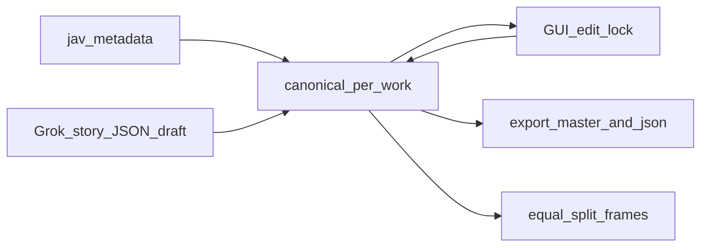

> **1차 구현 완료 (코드 기준)** — 아래 TODO는 `completed`로 둔다.  
> **`harvest-folder-sku`** · **`story-grok-module`** · **`pipeline-orchestrator`** · **`library-package`** · **`canonical-schema`** · **`grok-pipeline`** · **`equal-split-stills`** · **`export-sync`** · **`library-ui`** · **`transcription-queue-gui`** · **`multi-part-video`**  
> 실사용·통합 테스트는 추후 진행하며, 테스트 중 오류가 나오면 그때 해당 모듈을 고친다.

# JAVSTORY 라이브러리·통합 데이터 재설계 (제로베이스)

## 전제 (범위에서 제외)

- 레거시 **공장 모드**(`JAVSTORY_FACTORY_ROOT`, `03_COMPLETED` 트리, 워치독 배치 전제)는 **사용하지 않음**.
- 기존 `build_master_db.py`의 **공장 루트 스캔**에 의존한 갱신 경로는 **참고만** 하고, 새 설계의 기본 경로로 두지 않음.
- **VLM(비전 LLM) 단계** 및 이에 의존한 `web_database.json` 생성 파이프라인은 **본 설계에 포함하지 않음**. 스틸은 **Grok/사용자 구간 + 동등 분할**만 사용.

---

## 실행 모드: Harvest / Transcription / Translation

- **한 번에 (원스톱)**: 품번(또는 작품) 단위로 **세 단계를 연속 실행**하는 **일괄 파이프라인**을 둔다 (내부는 단계별 함수 호출).
  - **Harvest 단계에서 동영상이 들어 있는 폴더를 불러오면**, 그 안의 **동영상 파일 경로가 선택·검증**되고 canonical/DB 등에 **이후 단계와 공유**된다. 따라서 원스톱으로 이어질 때 Transcription/Translation에서 **경로를 다시 고르지 않아도** 된다(파일 존재·품번 일치 등 **자동 점검** 포함).
- **따로**: **Harvest만**, **Transcription만**, **Translation만** 실행 가능. GUI·CLI에서 **체크박스 또는 단계 선택**으로 제어.
  - **Harvest만** 실행하는 경우에도 **크롤링만** 할 수 있다. **폴더 기반**이면 원스톱과 동일하게 **폴더명 품번 추출 → 크롤**; **품번만 직접 입력**해도 크롤만 가능(영상 경로 없음). Transcription·Translation은 실행하지 않는다.
- **의존성 (원칙)**:
  - **Harvest**: 품번·메타·크롤 — 단독 가능. 입력은 **(1) 폴더 → 이름에서 품번 + 영상 경로 연결** 또는 **(2) 품번 직접 입력 → 크롤만(경로 없음)**. 원스톱이면 폴더를 썼을 때 이후 단계에 **영상 경로를 넘김**.
  - **Transcription**: 영상이 있어야 하므로 **동영상 파일 경로는 항상 확정(Fixed)** 된 상태에서만 진행한다. STT·일본어 교정·배경 등. **Grok 스토리 JSON**은 공통 모듈로 두고 **Harvest 직후에 생성**할 수 있으며, 없을 때만 Transcription 경로에서 보완(위 **「Grok JSON 생성 위치」**). **Transcription만** 실행할 때도 경로를 지정하고, 원스톱이면 Harvest에서 잡은 경로를 넘긴다. **GUI**는 아래 **작업 큐** 규칙.
  - **Translation**: 일본어 자막 → 한국어 — 입력으로 **교정된 JA SRT**(또는 정책상 원본 JA)가 필요 → **Transcription 산출 이후**가 자연스러우나, 이미 파일이 있으면 **번역만** 재실행 가능.
- **상태**: 품번별로 **어느 단계까지 완료**인지 표시(또는 산출물 존재 여부)해 두면, 일괄 실행 시 **이미 끝난 단계는 스킵**하거나 **강제 재실행**을 선택 가능하게 할 수 있다.

### Harvest: 크롤링 입력 방식 (폴더 또는 품번 직접 입력)

- **방식 A — 폴더**: 아래 **폴더 불러오기 → 품번 추출 → 크롤** (원스톱·Harvest만 공통).
- **방식 B — 품번 직접 입력**: 폴더 없이 **품번을 하나 이상 직접 입력**(또는 붙여넣기)해 **크롤링만** 수행 가능. 이 경우 **로컬 영상 경로는 연결하지 않음**(메타·DB만 갱신). 나중에 Transcription 등에서 영상을 지정하면 연결.

#### 폴더 기반 (방식 A)

- **단일 폴더**: **폴더 이름**에서 **정규식으로 품번** 추출 → 그 품번으로 크롤. 폴더 안 **동영상 파일 경로**는 해당 작업과 연결.
- **상위 폴더**: **하위 폴더 각각**에서 폴더명으로 품번 추출 → **다중 크롤** (깊이·재귀는 구현 시 명시).
- **다중 선택**: **폴더 여러 개** 선택 → 각 폴더명에서 품번 추출 → **일괄 크롤**.
- 추출 실패·중복·한 폴더에 품번이 둘 이상 매칭되면 **경고**, 스킵 또는 수동 수정.

#### 품번 직접 입력 (방식 B)

- 한 줄·쉼표·줄바꿈 등으로 **여러 품번**을 넣으면 **일괄 크롤** (형식 검증·중복 제거).

### Transcription: 영상 경로 고정 + GUI 작업 큐 (구현 시)

- **전제**: Transcription은 **로컬 동영상(또는 그로부터 추출한 오디오)**이 있어야 하므로, 실행 시점에 **영상 파일 경로는 고정**되어 있어야 한다.
- **다중 영상**: GUI에서 **동영상 파일을 여러 개 선택**할 수 있게 하고, **리스트 순서대로 순차적으로** Transcription 파이프라인을 돌린다 (한 건 완료 후 다음 건).
- **드래그 앤 드롭**: **파일** 또는 **폴더**를 리스트 영역에 떨어뜨려 추가 가능.
  - **폴더를 드롭**한 경우: **그 폴더 바로 아래**에 있는 동영상 파일만 후보로 넣고, **하위 폴더는 재귀하지 않음**(하위 폴더 안 파일은 **스킵**).
- **리스트 조작**: 각 행 **체크박스**로 일괄 실행 대상을 정하고(권장), **제거(X)** 로 해당 항목만 큐에서 뺀다.
- **중복 경로**: 같은 파일 경로가 두 번 들어오면 **하나로 합친다**(정규화 후 비교).
- **동영상 확장자**: 큐·DnD 후보에 포함할 **주요 확장자**를 지원한다 — 예: `.mp4` `.mkv` `.avi` `.mov` `.webm` `.m4v` 등 (구현 시 목록 고정, 대소문자 무시).

### 품번 ↔ 영상 연결 (방식 B 보완 — 승인)

- **품번만 크롤**(폴더 없음)한 뒤 Transcription을 돌릴 때는 **영상 파일명·상위 폴더명에서 품번을 추출**해 DB `product_code`와 **대조**하고, 불일치 시 **경고**한다. 수동으로 작품을 묶는 UX는 선택.

### 분할 영상 (Part1/2/3, A/B/C 등) — 합의

- **자동 감지**: 파일명에 `Part1`/`cd1`/`A`/`上巻` 등 패턴이 있으면 **같은 품번·같은 폴더**로 묶을지 UI에서 **제안**(사용자 확인).
- **자막 파일 (팟플레이어 등)**: 플레이어는 보통 **영상 파일과 동일한 베이스명의 SRT**만 자동 로드한다. 따라서 **파트마다** `영상명.srt` 형태로 **별도 산출**하는 것을 **기본**으로 한다. **여러 파트를 시간 오프셋으로 한 덩어리 SRT만** 내보내면, **파트 하나만 재생할 때 자막이 안 맞거나 안 붙는다.**
  - 내부 파이프라인(번역·전체 타임라인 정렬)용으로 **오프셋 합산한 논리 타임라인**을 쓸 수는 있으나, **사용자에게 주는 기본 내보내기는 파트별 동명 SRT** 우선.
  - (선택) 작품 **전체 합본 SRT**는 **별도 파일명**으로 “앱/참고용”에만 둘 수 있음.
- **Grok 스토리 JSON**: 품번(작품) **당 1회** 호출·캐시면 충분 **(승인)**.
- **스틸·타임라인 구간**: 라이브러리/편집 상에서는 **작품 전체를 하나의 타임라인**(파트 길이 합)으로 보고 스틸·구간을 묶어 관리 **(승인)**.

---

### Grok JSON 생성 위치 (공통 모듈 + Harvest 직후) — **승인**

- **가능하다.** `Transcription/story_context_report` 등 로직을 **공통 모듈**로 빼, **Harvest 직후**(또는 품번 직입력 크롤 직후) **선택 실행** → 결과는 **canonical/캐시**. Transcription은 **읽기 우선**, 없을 때만 보완.
- 원스톱: `Harvest → (Grok 스토리) → Transcription → Translation`.
- 번역 힌트 스키마는 기존 `format_story_context_for_translation`과 **호환** 유지.

---

### 저장·스틸·export 순서 — **승인**

1. **편집 저장** → 2. **시간/구간 바뀐 씬만 스틸 재추출** (글만 수정 시 스틸 생략) → 3. **내보내기** (`master_db.js`·story JSON 등).  
즉 **저장 → (필요 시) 그림 다시 → 내보내기**.

---

### Transcription 큐 UI — **승인**

- 행 **체크박스**로 실행 대상 선택·**중복 경로 합침**·**확장자 목록**·**X 제거** (위 문구대로).

---

## 1. 목표

- **품번·메타**: [Harvest `jav_metadata`](d:\App\JAVSTORY\Harvest\database.py)를 **단일 식별·표지·제목·배우·시놉**의 기준으로 사용.
- **씬·스토리·스틸**: Grok4 fast **웹검색 JSON**을 **초안**으로 저장하고, 사용자가 GUI에서 시간·씬 스토리 등을 수정; **수동 확정 + 보호**로 자동 갱신이 덮어쓰지 않게 함.
- **통합 내보내기**: 라이브러리/웹에서 쓰는 **`master_db.js` 동급 플랫 씬 목록**과 **Grok 호환 JSON**은 **편집 원본 한 곳**에서 파생(내보내기), 파일 두 개를 따로 “진실”로 두지 않음.
- **스틸 추출**: **Grok(또는 사용자 확정) `time_range` 구간 안에서 동등 분할**로 스크린샷 시각을 정하고 로컬 영상에서 프레임 추출. 구간·시각이 바뀌면 해당 씬만 재추출. **비전 LLM(VLM) 단계는 본 설계 범위에 두지 않음(제외).**

---

## 2. 진실은 하나 (Canonical store)

### 라이브러리 저장 위치 (루트)

- **기본 제안 (Windows)**: `%LOCALAPPDATA%\JAVSTORY\Library\` 를 **라이브러리 루트**로 두고, 환경변수 **`JAVSTORY_LIBRARY_ROOT`** 로 사용자가 바꿀 수 있게 한다.
- **품번별 하위**: `{library_root}/{품번}/` — `library_state.json`(또는 동일 역할 canonical), `stills/`(스틸), 기타 파생물. **절대 경로 이동에 대비**해 루트는 설정으로 통일하고, DB·canonical에는 가능하면 **라이브러리 루트 기준 상대 경로**를 저장한다.
- **Harvest DB** (`Harvest/jav_database.db`)는 **메타 인덱스**로 유지하고, 품번 행과 `{품번}` 폴더를 **연결**한다.
- **내보내기** (`master_db.js` 등): **프로젝트 루트** 또는 `{library_root}/export/` 중 하나로 고정(구현 시 선택) — SPA와 같이 쓰면 웹 루트 옆이 편할 수 있음.

---

- **권장**: 작품당 **하나의 편집 가능한 상태** (예: SQLite 테이블 행 + JSON blob, 또는 위 `{library_root}/{품번}/library_state.json` 단일 파일).
- 그 상태에서 **저장 시**:
  - `{품번}_story_context.json` (또는 동일 스키마) **export**
  - `master_db.js`용 **플랫 배열** (또는 동일 데이터의 JS 번들) **export**
- **GUI가 기본 편집 경로**. 사용자가 `master_db.js` / JSON을 에디터로 직접 고친 경우:
  - 다음 로드 시 **체크섬/수정시각**으로 불일치 감지 → **“어느 파일을 기준으로 할지 / 반대쪽을 맞출지”** 확인 대화.

### 로컬 영상과 파생 메타 (경로만 확보되면 일괄 해결)

- **영상 길이·fps·스틸**은 모두 **현재 유효한 로컬 파일 경로**만 있으면 계산·추출 가능(DB/Grok 텍스트만으로는 부족).
- DB에 **절대 경로만** 영구 저장하면 사용자가 파일을 옮기면 깨짐 → **미디어 루트 + 상대 경로** 저장, 또는 **경로 무효 시 “파일 다시 찾기”**로 canonical만 갱신하는 흐름을 둔다.
- 요지: **“어디에 두었는지”가 앱과 합의만 되면** 길이·fps·썸네일은 자동으로 따라온다.

---

## 3. Grok 초안 → GUI → 보호 규칙

- Grok 실행 시: 기존 [story_context 스키마](d:\App\JAVSTORY\Transcription\story_context_prompts.py)에 맞춘 JSON을 **초안**으로 저장.
- 사용자가 필드/씬을 수정하면 해당 항목은 기본적으로 **확정(locked)** — 이후 Grok 재실행 시 **덮어쓰지 않음**.
- 사용자가 **보호 해제**한 항목만 다음 Grok/자동 갱신에 **반영 가능**.
- **스토리 텍스트만** 바꾸고 **시간 구간은 그대로**면 **스틸 재추출 불필요**.

---

## 4. 스틸: 구간 내 동등 분할 (핵심 규칙)

**입력**: 각 씬의 `[start_sec, end_sec]` (Grok `time_range` 파싱 또는 사용자 확정).

**정책**:

- 구간을 **N등분**(또는 길이 비례 N)해 시각 `t₁…tₙ` 계산 후, 로컬 영상에서 해당 초의 **프레임 1장** 저장 및 씬에 경로 매핑.
- **짧은 구간**: 동등 분할이 겹치거나 동일 프레임이 되면 — **최소 간격(예: 0.5초)** 적용 또는 **1장만** 추출.
- **애매한 타임코드** (한 점만 있거나 구간 불명): **사용자가 구간 확정**하기 전에는 균등 분할·스틸 배정을 하지 않거나, 전체 본편 길이 대비 **보조 규칙**을 문서화해 선택 적용.
- 사용자가 **시간/구간을 수정**하면 → 해당 씬에 대해 **동등 분할 + 스틸 재추출**만 다시 실행.

---

## 5. 갱신 트리거

- **크롤 완료**: `jav_metadata` 갱신 → 라이브러리 카드 메타 반영.
- **Grok 스토리 완료**: 씬 초안·태그 갱신(보호되지 않은 필드만) → canonical 갱신 → export.
- **사용자 저장**: canonical이 최종 → 항상 export 재생성.

본 설계에서 라이브러리 씬 카드·`master_db` 동급 export의 **유일한 자동 소스**는 **Grok 스토리 JSON + 사용자 확정 구간 + 동등 분할 스틸**이다. 레거시 씬 파이프라인(`web_database` 등)은 **참고하지 않거나 제거 대상**으로 두고, 새 코드와 섞지 않는다.

---

## 6. 라이브러리 카드 (요약)

- **필수**: 표지, 한글 제목, 품번, 배우 한 줄.
- **권장**: 한 줄 요약(`synopsis_ko` 또는 Grok `overall_summary`), 메이커·발매일, 장르 칩.
- **씬 데이터 있을 때**: 씬 개수 배지, 대표 스틸 1~3장.
- 상세는 텍스트/긴 Grok 묘사는 **상세 뷰**로.

---

## 7. 미구현·후속

- 품번 ↔ 로컬 영상/산출물 경로를 DB 또는 규칙으로 **명시 연결** (폴더명만 의존 금지).
- (선택) Grok 씬 구간과 **자막(SRT) 타임라인** 정합·교차검증은 별도 단계로 둘 수 있음(VLM 없음).

---

## 8. 구현 배치 (모듈화)

- **프로젝트 루트에 전용 폴더 하나**를 두고, 본 설계 기능은 그 안의 **파이썬 패키지**로만 구현한다 (기존 `Transcription/`·`core/scene_analysis_v2/` 등 레거시와 **섞지 않음**).
- **폴더명**은 구현 시 정한다 (예: `Library/` 또는 `jav_library/`). 하위는 책임별로 나눈다:
  - **canonical**: 작품 단위 상태 로드·저장·보호 플래그
  - **grok_merge**: 초안 수신·Grok 재실행 시 잠긴 필드 보존
  - **stills**: `time_range` 파싱·동등 분할·프레임 추출·짧은 구간 예외
  - **export**: `master_db.js`·story JSON 내보내기·체크섬
  - (선택) **gui_bridge**: PyQt 등 UI는 얇게, 비즈니스 로직은 위 모듈 호출만
- **공개 API**는 패키지 `__init__.py` 또는 소수 모듈로 좁게 노출하고, GUI·스크립트는 그건만 import 하게 한다.

---

## 데이터 흐름 (요약)

