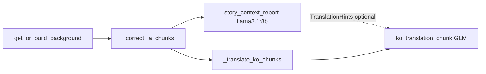

# 한국어 번역 파이프라인 — 통합 구현 플랜

## 목표

`[Transcription/subtitle_pipeline_orchestrator.py](d:\App\JAVSTORY\Transcription\subtitle_pipeline_orchestrator.py)`의 `run_for_product` 흐름에서 `**get_or_build_background` → 일본어 교정 → `_translate_ko_chunks` → `.ko.srt` 저장**까지 끊기지 않게 만든다. 번역은 **교정 파이프라인과 동일한 시간 청크 + JSON cue 배열** 패턴을 따른다.




- **스토리 분석(`llama3.1:8b`)** 은 **교정본 SRT**를 읽어 맥락 리포트를 만든다. **번역(`GLM 5.1`)** 과는 **별도 모델·별도 프롬프트**이다. 리포트는 번역 단계에 **선택적으로** `[TranslationHints]` 로만 주입한다.

### 통합 대상 파이프라인 (스토리 맥락 리포트를 **어디에** 넣을지)

- **넣을 곳(단일 기준)**: [`Transcription/subtitle_pipeline_orchestrator.py`](d:\App\JAVSTORY\Transcription\subtitle_pipeline_orchestrator.py) 의 **`SubtitlePipelineOrchestrator.run_for_product`**.
- **삽입 순서**: **`get_or_build_background` → `_correct_ja_chunks` → (신규) 스토리 맥락 리포트 → `_translate_ko_chunks`** — 즉 **일본어 교정 직후·한국어 번역 직전**. 입력 SRT는 번역과 동일하게 **`_resolve_ko_translation_input_path`와 같은 규칙**(교정본 `.corrected.srt`가 있으면 우선, 없으면 원본 `ja_srt_path`)을 쓰는 것이 자연스럽다.
- **산출물 연결**: 병합된 맥락 문자열을 **`translate_ja_segments_to_ko_async`** 쪽으로 **`TranslationHints` / `extra_hints`**(기존 번역 프롬프트 설계)로 넘긴다. 구현은 `kwargs` 예: `skip_story_context`, `story_context_report_path`, `story_analysis_tier` 등으로 켜고 끄기(플랜 후속).
- **넣지 않는 곳(별도 제품)**: 루트 [`batch_runner.py`](d:\App\JAVSTORY\batch_runner.py) 가 호출하는 **`core/scene_analysis_v2/pipeline.py`** 흐름(영상+VLM·웹 리포트·`web_database.json` 등)은 **씬 분석 v2.1 공장**이므로, **스토리 맥락 리포트(자막 기반 8B)의 기본 탑재 위치로 삼지 않는다**. 필요하면 나중에 **별도 옵션/후속**으로만 검토.
- **GUI**: [`scripts/subtitle_pipeline_test_gui.py`](d:\App\JAVSTORY\scripts\subtitle_pipeline_test_gui.py) 등이 **`run_for_product`만** 호출하면 위 순서를 그대로 따른다.

## 이미 정해진 설계 (대화·코드 기준)

### 입력 소스

- 번역 입력: `**_resolve_ja_corrected_output_path`로 구한 교정본이 파일로 있으면 그것**, 없으면 `**ja_srt_path`**.
- 선택 kwargs: `translate_ja_srt_path` 등으로 명시 오버라이드 가능(계획상).

### 배경 JSON

- `run_for_product`에서 `bg, _ = await get_or_build_background(...)` 후 `**background_json_str = json.dumps(bg, ensure_ascii=False, sort_keys=True)**` 를 만들어 번역 단계에 넘긴다.

### 레퍼런스 캐시

- `[Transcription/reference_collect.py](d:\App\JAVSTORY\Transcription\reference_collect.py)`의 `ko_translation_hints_for_prompt`로 `subtitle_guidance.ko_translation` 불릿을 `**render_glm_translation_chunk_user(..., extra_hints=...)**` 에 붙인다(없으면 생략).

### 프롬프트 (`[Transcription/background_prompts.py](d:\App\JAVSTORY\Transcription\background_prompts.py)`)

- 청크 경로: `**SYSTEM_GLM_TRANSLATION**` + `**render_glm_translation_chunk_user**` (`[Background]` → `[ChunkIndex]` → Task → `[Japanese Segments]` → 선택 `[TranslationHints]`).
- **제약(대화에서 합의·강화)**: **index / start / end(SRT 타임코드)는 입력과 동일**; 재서식·오프셋 금지. **응답은 파싱 가능한 JSON 배열 하나만** — 인삿말·잡담·마크다운·코드펜스 금지. `**RETRY_TRANSLATION_PROMPT`** 로 JSON·타임코드 불일치 시 재요청.
- 레거시 단일 블록: `**SYSTEM_GLM_TRANSLATION_LEGACY**` + `render_glm_translation_user` — 한국어 번역문만.
- 참고: 이 강화 문구를 **저장소 `.py`에 아직 못 넣은 세션**이 있으면, 구현 착수 시 동일 내용으로 `background_prompts.py`를 맞춘다.

### 번역 백엔드

- **기본**: OpenRouter `**z-ai/glm-5.1`**, 코드상 `[core.app_config](d:\App\JAVSTORY\core\app_config.py)`의 `**correction_llm_tier(2)**` 와 동일 소스(또는 `translation_llm_tier_openrouter()` thin wrapper).
- **선택(무비용)**: `**JAVSTORY_TRANSLATION_PROVIDER=ollama`**, `**JAVSTORY_TRANSLATION_OLLAMA_MODEL**` 기본 `**gemma4:e4b**`. kwargs `**translation_provider**`, `**translation_tier`(완전 dict면 최우선)**.
- `**resolve_translation_llm_tier(...)`** 로 최종 티어 결정.
- **Ollama** 분기: 교정과 같이 `ollama_ensure_model` / 종료 시 unload, `**JAVSTORY_TRANSLATION_CONCURRENCY`는 1**에 가깝게. OpenRouter는 2~3.
- **프롬프트는 모델 공통**으로 동일 사용(Gemma도 동일 `SYSTEM_GLM_TRANSLATION`); 순응도 차이는 재시도·백오프로 흡수.

### 출력

- `**kwargs.get("ko_srt_path")`** 또는 입력 stem 규칙으로 `**{stem}.ko.srt**` (`[_resolve_ja_corrected_output_path](d:\App\JAVSTORY\Transcription\subtitle_pipeline_orchestrator.py)`와 같은 디렉터리 규칙).
- 기존 `_write_simple_segments_srt` 등으로 저장.

## 구현할 파일·작업 (우선순위)

1. `**[core/app_config.py](d:\App\JAVSTORY\core\app_config.py)**`
  `TRANSLATION_PROVIDER_DEFAULT`, `TRANSLATION_OLLAMA_MODEL`, `translation_llm_tier_openrouter()`, `translation_llm_tier_ollama()`, `**resolve_translation_llm_tier**`.
2. `**[Transcription/ko_translation_chunk.py](d:\App\JAVSTORY\Transcription\ko_translation_chunk.py)**` (신규)
  - `translate_ja_segments_to_ko_async(...)`  
  - pysrt → `SimpleSegment` → 시간 청크(교정과 동일 `target`/`overlap`, env: `JAVSTORY_TRANSLATION_*` 또는 correction chunk env 폴백).  
  - 티어 `resolve` → `route_with_backoff` + `SYSTEM_GLM_TRANSLATION` / `render_glm_translation_chunk_user` / `RETRY_TRANSLATION_PROMPT`.  
  - `**correction_chunk`의 JSON 적용 로직 공개**(`apply_subtitle_json_chunk` 등) 또는 얇은 `[Transcription/subtitle_chunk_apply.py](d:\App\JAVSTORY\Transcription\subtitle_chunk_apply.py)` 분리로 중복 제거.  
  - Ollama: ensure/unload, 동시성 1.
3. `**[Transcription/subtitle_pipeline_orchestrator.py](d:\App\JAVSTORY\Transcription\subtitle_pipeline_orchestrator.py)`**
  - `run_for_product`: 배경 JSON 직렬화 후 `**_translate_ko_chunks**` 에 전달.  
  - `**_translate_ko_chunks**`: 입력 SRT 결정 → `translate_ja_segments_to_ko_async` → `.ko.srt` 기록.  
  - kwargs·모듈 docstring: `translation_provider`, `translation_tier`, `translate_ja_srt_path`, `ko_srt_path`, `should_cancel` 등.
4. `**Transcription/background_prompts.py**`
  대화에서 확정한 **타임코드 불변 + JSON만 + 메타응답 금지** 문구가 파일과 일치하는지 확인·반영.

## 맥락 리포트(스토리 분석) — Llama 3.1 8B · 슬라이딩 윈도우 (번역과 별도 단계)

**역할 분리**: **JA→KO 번역**은 **OpenRouter `z-ai/glm-5.1`**(기본). **스토리·인물·말투·호칭 가이드**용 **한국어 맥락 리포트**는 로컬 **Ollama `llama3.1:8b`** 로 생성한다. (Qwen 등은 다국어 혼입이 잘 나와 **본 파이프라인에서 스토리 분석에는 쓰지 않는 것**이 대화 기준이다.)

### 모델·런타임

- **태그**: `llama3.1:8b` (Ollama). 사용자 PC에 `ollama pull llama3.1:8b` 로 준비.
- **호출**: 기존 `[MultiTierRouter](d:\App\JAVSTORY\core\llm_engine.py)` + `api_key="ollama"` 패턴, `**LLM_TIERS`에 스토리 전용 티어** 추가하거나 env로 모델명만 주입 (`JAVSTORY_STORY_ANALYSIS_OLLAMA_MODEL` 등).
- **동시성**: STT/교정/번역과 겹치면 VRAM·지연 폭증 → **스토리 분석 호출은 순차 1** 권장(번역 Ollama와 동일 취지).
- **짧은 자막**: 윈도우 1개로 전체 SRT를 넣어 **한 번의 5섹션 출력**으로 끝낼 수 있으면 슬라이딩 생략.

### 샘플링·컨텍스트 (런타임 파라미터 — 프롬프트와 별도)

- **Temperature**: **0.1 ~ 0.3** (너무 높이면 산만해짐).
- **Top_p**: **0.9 ~ 0.95**.
- **Context**: **12K ~ 16K** 정도로 **코드에서 상한**을 둔다. **프롬프트만으로는 불충분**하므로 `시스템 프롬프트 + 사용자(SRT 청크)` 합이 예산을 넘지 않게 **자르거나** 슬라이딩으로 나눈다.
- **긴 자막**: **청크(윈도우) 단위로 나누어 분석하는 것을 강력 추천**. 한 번에 너무 길면 **8B 모델이 버거움** → 아래 **슬라이딩 윈도우 + 병합** 절과 동일 정책.

### 확정 시스템 프롬프트 (`SYSTEM_STORY_CONTEXT` 등 상수로 그대로 저장)

구현 시 사용자 메시지에는 `아래는 일본어 SRT입니다:\n\n` + SRT 본문(또는 청크)을 붙인다. **아래 블록은 수정 없이** `story_context_prompts.py` / `background_prompts.py`에 옮길 것.

```text
You are an expert story analyst specialized in Japanese AV subtitles.

Read the provided Japanese SRT subtitles carefully and generate a detailed context report **in Korean only**.

### 출력 형식
반드시 아래 5개 섹션만 정확히 출력하고, 다른 어떤 텍스트도 추가하지 마라.

# 1. 전체 스토리 요약
(영상의 전체 흐름과 기승전결을 3~4문장으로 간결하게 요약)

# 2. 주요 상황별 분리 (Scene Breakdown)
자막 흐름에 따라 주요 상황을 시간 구간과 함께 나누어 요약.  
예시 형식:  
- [00:03:40 ~ 00:07:00] 사무실 – 상사와 OL의 대치 및 역전  
- [00:57:45 ~ 01:02:00] 자동차 연수장 – 강사와 학생의 조교

# 3. 등장인물 및 페르소나
- 여성 주인공: 말투 특징, 캐릭터 성격, 역할
- 남성 인물(들): 역할과 여성과의 관계

# 4. 인물 간 관계 및 호칭 규칙
- 서로를 부르는 호칭
- 존댓말 ↔ 반말 사용 변화와 그 시점
- 관계의 변화 흐름

# 5. 번역 가이드라인 (가장 중요)
한국어 번역 시 반드시 지켜야 할 톤, 말투, 분위기, 주의점을 구체적으로 작성 (불릿 5~10개 권장)

### 추가 규칙
- 모든 분석은 제공된 자막에만 기반한다. 불확실한 부분은 “추정”이라고 명시한다.
- 보고서 전체는 **한국어로만** 작성한다. 일본어는 호칭 인용 시에만 사용한다.
- 자막이 길면 앞부분부터 순서대로 전체를 검토한 뒤 요약한다.
- 화자가 명확하지 않으면 “화자 불명” 또는 “추정”으로 표기한다.
```

- **플랜 부가 정책**(프롬프트에 없어도 구현 메모로 유지): **웹 검색 없음**(기본). 메타 배경 JSON과 병행 시 **자막과 모순되면 자막 우선**은 병합/힌트 단계에서 선택 정책으로 문서화 가능.

### 긴 자막 — 슬라이딩 윈도우 + 병합

- **한 번에 전체 SRT를 `llama3.1:8b`에 넣지 않는다** (8B·VRAM·지연·중후반 맥락 붕괴). **청크 단위 분석을 기본 가정**으로 둔다.
- **슬라이딩 윈도우**: 시간 기준(예: 10~~20분) 또는 **토큰 예산** 내에서 자막 블록 추출. **스트라이드 < 윈도우 길이**로 **30~~50% 겹침**(또는 경계만 30초~2분 overlap).
- **윈도우별**: 위와 **동일 5섹션** 구조의 **부분 리포트** (프롬프트 동일).
- **병합 패스**: 부분 리포트들을 입력으로 `**llama3.1:8b` 한 번 더**(또는 짧은 요약만 넣어 병합) → **단일 최종 5섹션 한국어 리포트**. 중복 장면·모순된 호칭 정리. 병합 입력이 길면 **섹션별 요약만** 넘김.
- **후처리**: 모델이 가끔 `# 1.` 앞에 한 줄 인삿말을 붙이면 `**# 1.` 로 시작하도록** 잘라내는 방어 로직 선택.

### 번역(GLM)과의 연결

- 최종 맥락 리포트 문자열을 `**render_glm_translation_chunk_user(..., extra_hints=...)`** 또는 `**[TranslationHints]**` 블록에 넣어 **GLM 5.1 번역**에만 넘긴다. **스토리 분석에 GLM을 쓰지 않아도** 된다(대화 확정).
- **JA→KO 번역 청크**(`ko_translation_chunk`)의 **시간 청크·JSON cue**와 **독립**: 맥락은 “시간 윈도우 슬라이스 + 병합”, 번역은 **교정 파이프라인과 동일 청크 규칙**.

### 구현 시 파일·설정 (후보)

- `**Transcription/story_context_prompts.py`** 또는 `**Transcription/background_prompts.py**` 에 스토리 분석용 **SYSTEM / USER 템플릿** 상수.
- `**Transcription/story_context_report.py`**: SRT 로드 → (옵션) 슬라이딩 윈도우 생성 → `llama3.1:8b` 호출 루프 → 병합 호출 → `str` 반환; 선택적으로 `**work_dir`에 `*_context_report.ko.md**` 저장.
- `**core/app_config.py**`: `STORY_ANALYSIS_OLLAMA_MODEL` 기본 `llama3.1:8b`, 윈도우 길이·스트라이드·최대 입력 토큰, `enable_story_context_report` 플래그.
- `**subtitle_pipeline_orchestrator.run_for_product**`: `skip_story_context` / `story_context_report_path` kwargs; 교정 완료 후·번역 전에 스토리 리포트 생성 → 번역 kwargs에 힌트 전달.

## 검증

- 짧은 `.ja.srt` / `.corrected.srt`로 `run_for_product` 호출 → `.ko.srt` 생성, **타임코드 보존** 육안 확인.
- OpenRouter / Ollama 각각 스모크(선택).
- **스토리 분석(`llama3.1:8b`)**: 짧은 SRT는 5섹션만·한국어 위주인지; 긴 SRT는 슬라이딩+병합 후 **#1~#5 구조** 유지 여부.
- `TranslationHints`에 맥락 리포트를 넣었을 때도 **번역 JSON의 타임코드 불변**이 깨지지 않는지.

## 범위 밖

- `[gui/v2](d:\App\JAVSTORY\gui\v2)`에서 `translation_provider` UI 연결(후속).  
- `_verify_scene_summary` 등 다른 오케스트레이터 스텁.
- 맥락 리포트의 **웹 검색**: 검색 API는 모델 밖 파이프라인; 본 플랜의 기본은 **자막만 근거**.

## 구현 완료 현황 (2026-04)

다음이 저장소에 반영되었다.

| 구분 | 내용 |
|------|------|
| 프롬프트 | [`Transcription/story_context_prompts.py`](d:\App\JAVSTORY\Transcription\story_context_prompts.py) — `SYSTEM_STORY_CONTEXT`, 병합용 `SYSTEM_STORY_CONTEXT_MERGE` |
| 리포트 생성 | [`Transcription/story_context_report.py`](d:\App\JAVSTORY\Transcription\story_context_report.py) — `build_story_context_report_async` (단일 패스 / 시간 슬라이딩 + 병합, `route_with_backoff`, Ollama ensure·unload) |
| 설정 | [`core/app_config.py`](d:\App\JAVSTORY\core\app_config.py) — `story_analysis_llm_tier()`, `STORY_ANALYSIS_OLLAMA_MODEL`, `STORY_ANALYSIS_TEMPERATURE`, `story_analysis_enabled_from_env()` |
| 번역 연동 | [`Transcription/ko_translation_chunk.py`](d:\App\JAVSTORY\Transcription\ko_translation_chunk.py) — `story_context_hints` → `[TranslationHints]`에 레퍼런스 힌트와 병합 |
| 오케스트레이터 | [`Transcription/subtitle_pipeline_orchestrator.py`](d:\App\JAVSTORY\Transcription\subtitle_pipeline_orchestrator.py) — `run_for_product`: 교정 → `_run_story_context_report` → KO 번역; kwargs `enable_story_context`, `story_analysis_tier`, `story_context_report_path`; `work_dir`이 있으면 `*_context_report.ko.md` 저장 |

**환경 변수 (스토리 맥락)**

- `JAVSTORY_STORY_ANALYSIS_ENABLED` — 기본 `1`(켜짐). `0`/`false`/`off`면 비활성(`enable_story_context`가 `True`면 kwargs 우선).
- `JAVSTORY_STORY_ANALYSIS_OLLAMA_MODEL` — 기본 `llama3.1:8b`
- `JAVSTORY_STORY_ANALYSIS_TEMPERATURE` — 기본 `0.4`
- `JAVSTORY_STORY_WINDOW_SEC` / `JAVSTORY_STORY_STRIDE_SEC` — 기본 `600` / `300`
- `JAVSTORY_STORY_MAX_CHUNK_CHARS` — 본문 예산(기본 `10000`)

