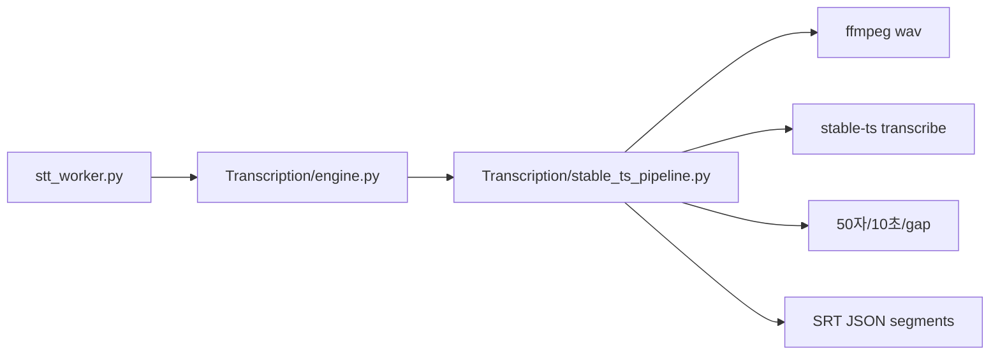

# Transcription — stable-ts 단일 옵션 전용

## 구현 현황 스냅샷 (코드 기준 · 혼동 방지)

아래는 **저장소 소스 기준**이다. 이전에 본 플랜 YAML의 `in_progress` / `pending` 과 어긋나면 **이 표를 우선**한다.

| 구분 | 상태 | 모듈·비고 |
|------|------|-----------|
| STT (stable-ts) | 완료 | `engine.py`, `stable_ts_pipeline.py`, `stt_worker` |
| 레퍼런스 캐시·품번 필터·CORRECTION_MODE | 완료 | `reference_collect.py` (`reference_v1` / `reference_v2`, `collect_reference_*_via_llm`) |
| 일본어 LLM 교정 (청크·Pass1/2/3·화자) | 완료 | `correction_chunk.py` — `ja_llm_correction.py`는 재수출 별칭 |
| JSON 파싱 견고성 | 완료 | `json_extract.py` |
| API 재시도·백오프 | 완료 | `llm_backoff.py` (HTTP `Retry-After` 헤더 직접 파싱은 없음 → 플랜 대비 보완 여지) |
| 배경 JSON 캐시 | 완료 | `background_context.py` |
| 통합 오케스트레이터 | **부분 완료** | `subtitle_pipeline_orchestrator.py` — `get_or_build_background`·`_correct_ja_chunks`(→ `correct_ja_segments_async`, `{stem}.corrected.srt`) **완료**; `_translate_ko_chunks`·`_verify_scene_summary`는 **스텁** |
| 한국어 자막 청크 번역 | **미구현** | Transcription 내 전용 파이프라인 없음; 오케스트레이터 KO 스텁과 동일 |

**삭제됨:** 예전 `Transcription/Obsolete/` 등 레거시 트리(신규 코드에서 경로 금지 원칙은 동일).

### 다음 구현 로드맵 (우선순위 · 2026-04)

위 YAML `todos`의 남은 `pending`과 동일 순서로 진행한다.

**완료(참고): `orchestrator-ja`** — `run_for_product` → `ja_srt_path`(없으면 교정 스킵)·`product_code`·선택 `work_dir` / `ja_corrected_srt_path`·`correct_ja_segments_async` 전달 kwargs → `{stem}.corrected.srt` 저장.

1. **`ko-translation-chunks`** — JA 교정 결과를 입력으로 하는 KO 청크 LLM 번역 모듈(신규 파일 권장) → `_translate_ko_chunks`에서 호출 → `.ko.srt` 저장. 레퍼런스 `subtitle_guidance.ko_translation` 주입 규칙은 플랜의 reference_v2 절과 맞출 것.
2. **`verify-scene-summary`** — 검증 입력(예: `web/web_database.json`, 배경 JSON, DB 씬 요약)과 합격 기준을 먼저 고정한 뒤 `_verify_scene_summary` 구현. 배치 공장(`batch_runner`)과 연동 여부는 별도 결정.
3. **`llm-retry-after`** — 운영 중 RPM 한도가 문제일 때만: `route_with_backoff`에서 응답 헤더 `Retry-After` 초 단위 대기 추가.

## 구현 준수 원칙 (필수)

- **본 계획서가 단일 진실 공급원(SoT)이다.** `Transcription`·자막 교정·레퍼런스 수집 관련 코드를 추가·수정할 때는 **항상** 이 파일(저장소 기준 `.cursor/plans/transcription_stable-ts_이식_d9a90db7.plan.md`)을 기준으로 하고, 여기에 적힌 범위·금지 사항·아키텍처·파일 구조를 **벗어나지 않는다.**
- **플랜 이탈 금지:** 구현 편의·시간 절약을 이유로 단축하거나 우회하지 않는다. 플랜에 없는 STT/교정 스택을 임의로 넣거나, 기존 코드를 “잠깐만” 재사용하는 방식은 하지 않는다. **요구사항이 바뀌면 이 계획서를 먼저 수정·합의한 뒤** 코드에 반영한다.
- **레거시 Obsolete 금지 (명시):** 새 코드 경로에서 **삭제된 Obsolete 트리·패키지를 import·호출·래핑하지 않는다.** 삭제된 `core/Whisper.py` 등 과거 엔진도 동일. 필요한 동작은 본 플랜·스펙에 따라 **신규 파일에만** 둔다. (과거 `correct_with_llm` 등 **이름만 빌려 쓰는 우회**도 금지.)
- **검증:** 병합·배포 전 신규 `Transcription`·교정 경로에서 Obsolete/레거시 엔진 의존이 0인지 확인한다(예: `rg Obsolete`, `rg Whisper.py` 등). 아래 `no-legacy` todo와 동일 취지.

## 범위 (사용자 요청 반영)

- **완전 신규 구현**: STT·자막 교정·레퍼런스 수집은 **신규 모듈에 구현**한다. **삭제된 Obsolete 트리·`core/Whisper.py`·과거 엔진을 import하거나 복붙하지 않는다.**
- **백엔드는 하나만**: `stable_ts` / `WhisperModel` + `transcribe` + `split_by_length(50)` / `split_by_duration(10)` / `merge_by_gap(0.1)` / `to_srt_vtt` 흐름만 사용한다.
- **Obsolete 트리**: 저장소에서 삭제됨. **로컬에 남은 복사본이 있어도 신규 코드에서 import·참조 금지**. 배포 전 `rg Obsolete` 등으로 의존성 0 확인 권장.
- **진입점**: [`gui/v2/workers/stt_worker.py`](d:/App/JAVSTORY/gui/v2/workers/stt_worker.py)는 `from Transcription.engine import …` 유지. **`Transcription/engine.py`를 위 계약에 맞춰 신규 작성.** `STT_PRESET_DEFAULT` 등은 상수 스텁 또는 제거 후 워커와 합의.
- **LLM 교정**: Obsolete의 `correct_with_llm` **미사용**. 구현체는 [`Transcription/correction_chunk.py`](d:/App/JAVSTORY/Transcription/correction_chunk.py) + [`reference_collect.py`](d:/App/JAVSTORY/Transcription/reference_collect.py) — 플랜의 `reference_strong` / `reference_weak` / `baseline_only` 및 청크·Pass2/3. STT `engine` 기본은 **`with_llm=False`**(교정은 별 호출).

## 아키텍처 (단일 경로)



## 구현 요약

1. **`Transcription/stable_ts_pipeline.py`** (이름 가변)
   - `torch` / `stable_ts` 또는 `stable_whisper`에서 `WhisperModel` 로드(사용자 스크립트와 동일 kwargs).
   - **`transcribe`의 VAD**: 긴 영상 1패스 시 RAM 피크 완화를 위해 **VAD가 켜진 상태**로 호출한다(`vad=True` 등 라이브러리 실제 API에 맞게). 구현 후 **체크리스트로 “VAD 활성” 확인**(기본값에만 의존하지 말고 코드/로그에 명시).
   - `download_root`: 예) `%LOCALAPPDATA%\JAVSTORY\whisper_models` 또는 프로젝트 `whisper_models` — 한 곳으로 고정.
   - 입력: 영상 경로 → 내부에서 **ffmpeg-python 등으로 WAV 추출**(Obsolete `audio.py`에 의존하지 않고 최소 구현).
   - 출력: 후처리까지 적용한 SRT 경로; `pysrt` 등으로 `SimpleSegment` 리스트 생성해 `engine`이 JSON/SRT 저장 규칙에 맞게 쓴다.
   - `should_cancel`이 있으면 전사 루프에서 주기적으로 확인해 중단 가능하면 반영(불가 시 문서화만).

2. **`Transcription/engine.py`** (전부 신규)
   - `process_video_to_segments(...)`: `stable_ts_pipeline`만 호출해 SRT/세그먼트 저장. **레거시 LLM 교정 호출 없음**; `with_llm`은 호환용 시그니처만 두고 **기본 False** 또는 no-op(로그 한 줄) 후 **별도 교정 파이프라인**에서 처리.
   - **`clear_vram`**: `torch.cuda.empty_cache()` 전에 **`gc.collect()`를 명시 호출**(순환 참조·대형 텐서 해제 유도). CUDA 사용 시에만 `empty_cache`.
   - `STTCancelled`, `STTProgressEvent` — 워커와 필드 호환 유지.

3. **`Transcription/__init__.py`**
   - 패키지로 인식되도록 최소 내용.

4. **`requirements.txt`**
   - `stable-ts` 추가. (OpenAI Whisper 등 전이 의존은 pip에 맡김.)

5. **GUI [`gui/v2/views/processing.py`](d:/App/JAVSTORY/gui/v2/views/processing.py)**
   - 4단 프리셋 콤보·`_STT_PRESET_BY_INDEX` 제거 또는 “자막 생성(Whisper)” 단일 표시로 단순화.
   - [`stt_worker.py`](d:/App/JAVSTORY/gui/v2/workers/stt_worker.py): `stt_preset` 인자 제거 또는 무시.

## 삭제·비포함

- Obsolete·과거 STT/교정 파일에 대한 **의존·재사용 금지**(이전 파일 안 씀).
- 다중 프리셋 분기; 설정은 `engine` 또는 `stable_ts_pipeline` 내 상수 한 블록으로 고정.

## 리스크

- **large-v2 + PyTorch** VRAM/RAM 사용량 큼.
- 전체 파일 1패스 전사로 긴 영상에서 메모리 피크가 클 수 있음 → **완화**: `transcribe` 시 **VAD 활성**으로 무음/저에너지 구간 처리에 맡겨 피크를 줄인다(라이브러리 문서 기준 옵션명 확인).
- 작업 종료 시 **`gc.collect()` + `empty_cache()`**로 VRAM 회수를 극대화.

---

## 자막 교정 (사용자 확정 설계 — STT 이후 별도 단계)

STT(`stable-ts`) 산출 SRT를 입력으로 하며, **전사와 분리**하고 **필요할 때만** 돌린다.

### 화자 표시 (`- `)

- **기본**: 화자 접두어 **없음** (잘못된 화자 분리로 몰입 저해 방지).
- **선택**: 대화 턴이 **명확히 바뀔 때만** `- ` 접두어 허용하도록 프롬프트에 지시.
- **구현 옵션**: 사용자 설정 **「화자 표시 OFF / ON」** 두 모드(ON일 때만 턴 변화 시 `- ` 규칙 적용).

### 청크·타임스탬프

- 전체 자막을 한 번에 넣지 않고 **약 40~60초 단위**로 잘라 교정 → 토큰·환각 완화.
- **시작/끝 타임스탬프는 불변**; 모델은 **해당 구간 `text`만** 수정. 출력은 파싱 검증(줄 수·인덱스·타임 키 일치).

### 응답 파싱 견고성 (채택 보완)

프롬프트에 “JSON 배열만”을 넣어도 MiniMax·Claude 등은 **` 

```json … 

``` ` 펜스**, 맺음말(“교정된 자막입니다”), 프리앰블을 붙이는 경우가 있다.

- **`Transcription/json_extract.py` 등 신규 유틸**에서 원문 문자열 → **순수 JSON 배열 문자열** 후보를 뽑는다.
  - 1단계: 줄 단위로 **펜스 제거**(` 

``` ` / ` 

```json ` 블록 스트립).
  - 2단계: 첫 `[`부터 **괄호 균형**(depth 카운트)으로 매칭되는 `]`까지 슬라이스 — 중첩 객체·문자열 이스케이프까지 고려해 단순 정규식 `\[.*\]`만 쓰지 않는 것이 안전(그리디 `. *`는 중간 `]`에서 잘몤 자를 수 있음).
  - 3단계: `json.loads` 실패 시 **보조**: 트레일링 쉼표 제거 등 최소 수리 후 1회 재시도(과도한 휴리스틱은 지양).
- 청크 루프는 **파싱 실패 시 해당 청크만 재시도** 또는 원문 유지 + 로그 정책을 플랜에 맞게 고정.

### 3단계 모델 역할 (요약)

- **Step 1**: Grok 4.2 Multi-Agent 등으로 웹 검색 → 레퍼런스 파일(스토리·인물·말투·반복 패턴). **작품당 1회 생성 후 캐시·재사용**.
- **Step 2**: **MiniMax M2.5** 주교정 — STT 호흡·길이 유지, **없는 대사 금지**, **50자**, 과도한 순화 금지, 레퍼런스 말투 반영.
- **Step 3**: **Claude Sonnet** 별미, **사용자 명시 시만** — Step 2와 **동일 하드 제약**을 프롬프트에 그대로 복사(순화·길이 팽창 방지).

### 비용·효율

- 레퍼런스: **작품(또는 품번)당 1회** 생성·저장, 이후 교정/번역에서 재사용.
- 교정 파이프라인: **요청 시에만** 실행(배치/버튼/플래그).

### API Rate Limit·재시도 (채택 보완)

40~60초 청크면 **2시간 영상 ≈ 120~180회** 호출 가능 → OpenRouter 등 **RPM**(분당 요청 한도)에 걸리기 쉽다.

- **`tenacity`**(또는 동등)로 청크별 HTTP 클라이언트 래핑: **지수 백오프 + 지터(jitter)**, 최대 재시도·최대 대기 상한 명시.
- **429 / rate-limit 응답**을 재시도 대상으로 포함; 응답 헤더에 **`Retry-After`**가 있으면 우선 적용.
- 기본은 **순차 청크**(병렬 시 동시성 상한·RPM 배수 주의). 플랜 단계에서는 순차를 기본으로 두고, 나중에 제한 내 소량 병렬만 검토.

### 레퍼런스 품질 관리 (Reference Quality Management)

웹 검색 기반 레퍼런스는 교정 컨텍스트로 유용하다. **현재 인식**: 사람이 매번 **전수 검수**하기는 일괄 처리에 비효율하고, 모델이 만든 레퍼런스를 **그대로 믿고 쓰면** 교정 결과가 잘못된 정보에 끌릴 수 있다. 아래 **채택 보완 1~5**와 **reference.json·프롬프트·품번 단속**으로 **정확성·신뢰도를 체계적으로** 관리한다.

#### 채택 보완 방향

1. **신뢰도 메타데이터** — Grok Multi-Agent가 **`source_url`**, **`confidence`**(0.0~1.0), **`human_review_needed`**를 **항목 단위**로 출력(출력은 **구조화 JSON만**).
2. **휴리스틱 필터링** — URL 부재·저신뢰 도메인·**품번/타이틀 불일치** 시 코드가 **`confidence` 상한 캡** 또는 **`human_review_needed = true`** 강제.
3. **레퍼런스 강도** — `confidence` 높고 `human_review_needed == false`이면 **강한 사실**; 그 외(또는 배치 다운그레이드)는 **약한 힌트**(프롬프트에 “참고 수준” 명시).
4. **캐시 무효화** — `prompt_version`, `model`, `collected_at` 등 메타 기록, 변경 시 **재수집**.
5. **배치 정책 — 기본 실용 모드** — 미달 시 **경고 로그**만 남기고 교정 계속, 레퍼런스를 **약한 힌트로 다운그레이드**. **보수 모드**(스킵/대기)는 플래그로 전환 가능하게 설계.

#### 품번 오검색 단속 (예: STAR-471 vs START-471, STAR-0471)

- **`product_code_canonical`**: 파이프라인에서 정한 **단일 기준 품번**(대문자·하이픈·**숫자 자릿수**까지 고정). “비슷하면 같은 작품”으로 완화하지 않는다.
- **Grok 검색 프롬프트(필수)**  
  - 검색어에 **따옴표로 감싼 캐논 품번** 포함(예: `"STAR-471"` + 제목 일부).  
  - 수집하는 페이지 본문·스니펫에 **캐논 문자열과 동일한 품번**이 등장하는지 확인; 없으면 URL 폐기.  
  - **`START-471`**(글자 삽입), **`STAR-0471`**(0 삽입·자릿수 변형), **`STAR-47`**(숫자 누락) 등은 **다른 품번**이므로 근거로 사용 금지·요약에 섞지 말 것.
- **후처리(코드, 필수)**  
  - `evidence_snippet`·페이지 본문에서 캐논 품번에 대해 **단어 경계·literal 전체 일치**(regex escape, 대소문자는 캐논 기준)만 통과.  
  - 본문에서 **동일 레이블 패턴**(예: `[A-Z]{2,10}-\\d{3,5}` 등 프로젝트 고정 규칙)으로 품번 후보를 찾았을 때, **캐논과 정확히 같은 토큰이 없고** 다른 토큰만 있으면 해당 claim·소스는 **폐기** 또는 `product_code_verified: false` + `confidence` 캡 + `human_review_needed: true`.  
  - **편집 거리·유사도**로 “거의 맞는 품번”을 캐논으로 인정하지 않음(오검색 허용 방지).  
  - 선택: 디버깅용 `meta.rejected_near_miss_examples`(문자열 배열, 최대 N건)에 버린 후보만 기록.
- **집계**: `product_code_verified=false` 비율·전체 검증 실패율이 임계치를 넘으면 `meta.effective_strength = "weak"` 일괄 적용.

#### reference.json 스키마 (`reference_v1`) — 수집 + 교정 파라미터

파일 예: `Transcription/reference_cache/{product_code_canonical}__pv{prompt_version}.json`

#### 캐시 용량·확장성 (작품 수·런타임)

- **작품 수가 많아져도 “한 덩어리 JSON”이 커지지는 않게** 한다. 캐시는 **품번(작품)당 파일 1개**가 기본 — 전체 라이브러리를 하나의 `master_reference.json`에 몰아넣지 않는다.
- **런타임**에서 교정기·수집기는 **현재 작업 품번의 파일만** `open`한다. UI 목록·검색은 **경량 인덱스**(품번, 제목, `collected_at`, 파일 경로, 바이트 크기만 있는 `reference_index.json` 또는 DB 테이블)로 처리하고, 상세 본문은 필요 시에만 로드.
- **작품 1편 내부**가 무거워질 수 있는 경우는 주로 **씬별 한국어 요약 배열(`scenes_ko` 등)** 과 긴 `claims`다. 완화책:
  - **프롬프트 상한**: 씬 요약은 구간당 문자 수·항목 수 **하드 캡**(예: `max_scenes`, 요약 N자 이하).
  - **파일 분리(선택)**: `…__correction_ja.json`(교정용 초경량) + `…__story_ko.json`(스토리·UI용) — 교정 파이프라인은 전자만 읽음.
  - **나중 단계**: 동일 스키마를 SQLite/Parquet로 옮기고 JSON은 수출용만 유지.
- **저장소**: `.json.gz` 압축은 선택; git에는 캐시 디렉터리 제외(`.gitignore`).

**최종 채택 (사용자 확정)**  
- **높음**: `confidence >= 0.75` AND `human_review_needed == false` AND `product_code_verified` → 강한 레퍼런스.  
- **중간**: `0.5 <= confidence < 0.75` AND `human_review_needed == false` AND `product_code_verified` → **`correction.allow_weak_reference == true`일 때만** 약한 블록.  
- **낮음** 또는 **`human_review_needed == true`**: 강·약 **모두 제외**. 주입 가능 클레임이 없으면 `baseline_only`.

```json
{
  "schema_version": "reference_v1",
  "meta": {
    "product_code_canonical": "STAR-471",
    "product_code_aliases": ["STAR-471"],
    "title_ja": "",
    "collected_at": "2026-04-02T12:00:00",
    "model": "grok-4.2-multi-agent",
    "prompt_version": "ref-collect-2026-04-02",
    "review_status": "pending",
    "reviewed_at": null,
    "effective_strength": "strong",
    "code_match_policy": "literal_full_string",
    "notes": "post_filter applied",
    "rejected_near_miss_examples": []
  },
  "correction": {
    "allow_weak_reference": true,
    "threshold_strong_min": 0.75,
    "threshold_weak_min": 0.5,
    "speaker_prefix_mode": "off",
    "last_resolved_mode": null,
    "last_resolved_at": null,
    "last_claim_counts": {
      "strong_injected": 0,
      "weak_injected": 0,
      "excluded_low_or_review": 0
    }
  },
  "claims": [
    {
      "id": "claim_001",
      "category": "story_summary",
      "text": "요약 한 줄",
      "source_url": "https://example.com/page",
      "source_domain_tier": "allowlist_a",
      "confidence": 0.82,
      "human_review_needed": false,
      "product_code_verified": true,
      "evidence_snippet": "…STAR-471…"
    },
    {
      "id": "claim_002",
      "category": "character_voice",
      "text": "말끝이 짧다",
      "source_url": "https://example.com/b",
      "source_domain_tier": "allowlist_a",
      "confidence": 0.62,
      "human_review_needed": false,
      "product_code_verified": true,
      "evidence_snippet": "STAR-471 掲載…"
    },
    {
      "id": "claim_003",
      "category": "setting",
      "text": "불확실한 설정",
      "source_url": null,
      "source_domain_tier": "unknown",
      "confidence": 0.4,
      "human_review_needed": true,
      "product_code_verified": false,
      "evidence_snippet": ""
    }
  ],
  "characters": [],
  "global_flags": {
    "reference_unreliable": false,
    "any_human_review_needed": true,
    "min_claim_confidence": 0.35
  }
}
```

- **`claims[]`**: 원자 주장. `category`: `story_summary` | `character_voice` | `setting` | `other` 등.  
- **`product_code_verified`**: 캐논 품번 literal 근거(코드 설정).  
- **`meta.effective_strength`**: 수집 후 휴리스틱 `strong` | `weak`.  
- **`correction`**: 교정기 정책. `allow_weak_reference`, 임계값, 화자 모; **`last_*`는 교정 실행 후 선택적 기록**.  
- **`CORRECTION_MODE` 결정**: (1) Strong≥1 → `reference_strong` (`REF_STRONG` 채움; Weak는 `allow_weak_reference`일 때만 병행). (2) Strong==0, Weak≥1, 플래그 true → `reference_weak`. (3) 그 외 → `baseline_only`.

#### 교정 프롬프트 — 플레이스홀더와 모드별 예시

**플레이스홀더**

- `{{CHUNK_JSON}}`: 해당 40~60초 청크 자막 배열 `[{index, start, end, text}, …]`
- `{{REF_STRONG_BLOCK}}`: 강 버킷 클레임을 사람이 읽기 쉬운 텍스트(또는 JSON)로 직렬화한 문자열; 없으면 빈 문자열.
- `{{REF_WEAK_BLOCK}}`: 약 버킷만; 없으면 빈 문자열.
- `{{SPEAKER_RULE}}`: 기본 `"화자 접두어는 넣지 마라."` / ON 시 `"대화 턴이 분명히 바뀔 때만 해당 줄 앞에 '- '(하이픈+공백) 허용."`

**번들 다운그레이드**: `meta.effective_strength == "weak"`이고 Strong 클레임이 0이면 baseline_only 강제 등, 수집 메타와 결합 가능.

---

**예시 1 — `reference_strong` · 시스템**

```text
역할: 일본어 STT 자막 청크를 교정한다.

[최우선]
- 각 줄의 시작·끝 타임스탬프는 변경하지 않는다.
- 한 줄당 최대 50자(프로젝트에서 정한 글자 세기 규칙을 일관 적용). 초과 시 의미 보존 범위에서만 축약.
- 대사 창작·각색·없는 내용 추가 금지. 신음·의성어를 과도하게 문어로 바꾸지 마라.
- 말투·리듬·짧은 호흡은 STT 원문에 최대한 맞춘다.

[레퍼런스 — 강한 모드]
아래는 출처·품번이 검증된 작품 컨텍스트다. 인물·어조 정리에만 사용하라. STT 텍스트·타임코드와 충돌하면 STT를 따른다.
---
{{REF_STRONG_BLOCK}}
---

{{SPEAKER_RULE}}

출력: 입력과 동일한 순서의 JSON 배열만. 원소 형식: {"index": 정수, "start": "원본 그대로", "end": "원본 그대로", "text": "교정된 문자열"}
설명 문장·마크다운·JSON 바깥 텍스트 금지.
```

**예시 1 — 유저**

```text
청크 자막:
{{CHUNK_JSON}}
```

---

**예시 2 — `reference_weak` · 시스템** (Strong 없음, Weak만 주입. Strong+Weak 병행 시에는 위 시스템에 Weak 절을 추가해도 됨.)

```text
역할: 일본어 STT 자막 청크를 교정한다.

[최우선]
- 타임스탬프 불변. 줄당 50자 이하. 비창작. STT 호흡·리듬 우선.

[레퍼런스 — 약한 힌트]
아래는 참고용이다. 단정하거나 설정을 확장하지 마라. STT와 모순이면 레퍼런스를 버리고 STT만 따른다. 말투를 바꾸려고 문장을 늘리지 마라.
---
{{REF_WEAK_BLOCK}}
---

{{SPEAKER_RULE}}

출력 형식은 reference_strong과 동일.
```

**예시 2 — 유저**

```text
청크 자막:
{{CHUNK_JSON}}
```

---

**예시 3 — `baseline_only` · 시스템**

```text
역할: 일본어 STT 자막 청크에서 명백한 전사 오류만 최소한으로 고친다.

규칙:
- 시작·끝 타임스탬프는 절대 변경하지 않는다.
- 한 줄 50자 이하. 줄 개수·순서·index 유지.
- 대사 추가·삭제·각색 금지. 외부 작품 정보·인물·줄거리는 추론하거나 보강하지 않는다(이 요청에는 레퍼런스가 없다).
- 동음이의·띄어쓰기·명백한 오타 수준만 수정한다. “고급스럽게” 같은 문체 재작성 금지.

{{SPEAKER_RULE}}

출력: [{"index": int, "start": str, "end": str, "text": str}, ...] 만. 그 외 텍스트 금지.
```

**예시 3 — 유저**

```text
{{CHUNK_JSON}}
```

---

공통: 50자·타임코드 고정·비창작·화자 기본 OFF.

**로깅**: `CORRECTION_MODE`, `strong_injected`, `weak_injected`, `excluded_low_or_review`, `allow_weak_reference`, `product_code_canonical`.

#### 자동·저비용 보조

- 도메인 티어 화이트/그레이·블랙리스트로 `confidence` 캡.
- 오래된 캐시는 `stale` 표시만 또는 선택 재조회.
- (선택) 저비용 2차 호출로 “이 번들이 품번 X와 모순?”만 검사해 `weak` 전환.

### 구현 시 파일 예시 (참고)

- `Transcription/reference_cache/…`, `Transcription/reference_collect.py`(Grok·검증·캐시)
- `Transcription/correction_chunk.py` — 청크 분할, `REF_*` 주입, API(tenacity 백오프), SRT 재조립
- `Transcription/json_extract.py`(가칭) — 모델 응답 → JSON 배열 문자열 추출 전용

(교정 모듈은 STT `engine.py`와 **의존 분리**.)

---

## 레퍼런스·교정 경로 — 알려진 리스크와 해결 방안 (채택)

구현·운영 중 아래 이슈가 나올 수 있으므로, **코드 변경 시 본 절을 우선 반영**한다. (SoT 본 문서의 일부.)

### 1) `reference_cache` 다중 `__pv*.json` → 잘못된(구버전) 파일 로드

- **문제:** `load_reference_v1`이 glob 결과를 단순 정렬해 **첫 성공 파일**만 쓰면, `JAVSTORY_REF_PROMPT_VERSION`(또는 파일명의 `pv`)이 바뀌어도 **이전 프롬프트 버전 캐시**가 계속 선택될 수 있다.
- **해결 (권장 순):**
  1. **정확 일치:** 현재 실행 중인 `prompt_version`과 일치하는 `{safe}__pv{prompt_version}.json`만 로드. 없으면 캐시 미스로 보고 재수집.
  2. **완화:** 동일 품번 후보 중 **수정 시각(mtime) 최신** 파일을 선택(로그에 경로·버전 명시).
  3. **운영:** 버전 갱신 후 구버전 파일 삭제 또는, 폴백 시 로그에 `stale_reference_fallback` 태그.

### 2) 캐시 미스 시 Grok(Pass1 계열) **연속 2회** 호출 — 비용·레이트리밋

- **문제:** `collect_reference_v1_via_llm` 1회 + 교정 파이프라인의 Pass1 컨텍스트 프롬프트 1회로, 같은 티어에 **백투백 호출**이 발생할 수 있다.
- **해결 (택1):**
  - **단일 응답 병합:** 한 번의 Grok 호출 출력에 `reference_v1` + Pass1용 요약(`characters`/`story_summary` 등)을 모두 넣고, 파싱 후 캐시 저장과 `context_json` 채움을 동시에 처리.
  - **조건부 생략:** 방금 `reference_v1` 수집에 성공했다면 Pass1 전용 호출을 건너뛰고, **레퍼런스에서 추린 짧은 컨텍스트**만 주입(토큰 상한 유지).

### 3) `JAVMetadata` 조회 — 품번 대소문자·시놉시스 필드

- **문제:** `product_code` 비캐논(소문자 등)이면 행 미스매치. 시놉시스가 `synopsis_ja` 등에만 있고 레거시 `synopsis`는 비어 있으면 수집 품질 저하.
- **해결:** DB 조회 전 `product_code`를 **`canonical_product_code`와 동일 규칙**으로 정규화. 시놉시스는 **`synopsis_ja` → `synopsis_ko` → `synopsis`** (또는 env로 우선 언어) 순 폴백.

### 4) `collect_reference_v1_via_llm` — 재시도·백오프 부족

- **문제:** 교정 청크는 지수 백오프가 있어도, 수집 경로는 단발 `router.route`면 429/타임아웃에 취약하다.
- **해결:** `correction_chunk`의 `_route_with_backoff`와 **동일 정책**을 공유하거나, `reference_collect`에서 동등 처리. 실패 시 교정은 `baseline_only`로 계속 가능하나, 로그에 `reference_collect_failed` 명시.

### 5) 후처리·DB 아카이브(추가 구현 시)

- **문제:** `claims`만 검증하고 `characters`/`relationships`/`scenes`는 그대로 DB에 들어가면 환각이 아카이브에 고정될 수 있다. `JAVMetadata` 자동 보강 시 수동 편집본 덮어쓰기 위험.
- **해결:** 엔티티 단에도 동일한 **literal 품번·URL·`human_review_needed`** 규칙 적용. DB는 `(product_code, prompt_version, model)` 단위 **버전 보존** 또는 덮어쓰기 전 플래그. **`JAVSTORY_ARCHIVE_UPSERT_SYNOPSIS` 등 env로 메타 갱신 기본 OFF.**

### 6) OpenRouter 「Multi-Agent / 웹 검색」 기대치

- **문제:** 플랜의 “웹 검색”은 **실제 브라우저가 아니라** 모델·프로바이더가 허용하는 범위 내 추론/도구에 의존할 수 있다.
- **해결:** 프롬프트에서 **근거 URL·snippet·품번 literal**을 강제하고, 코드 후처리로 검증; 기대치는 “항상 완전한 웹 크롤”이 아니라 **검증 가능한 클레임만 주입**으로 맞춘다.
