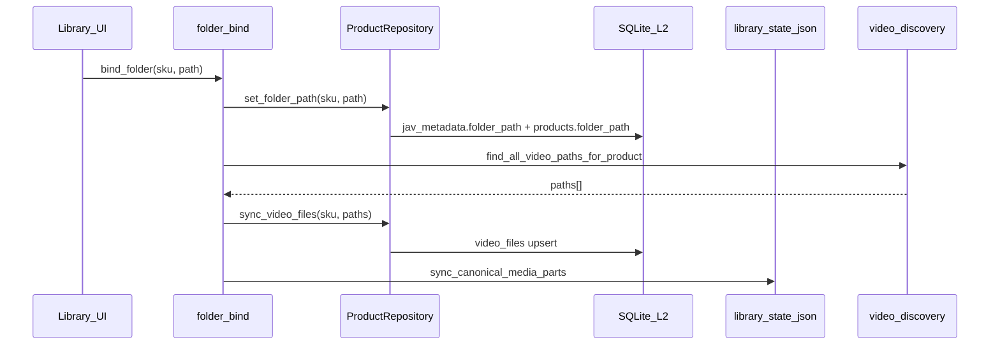
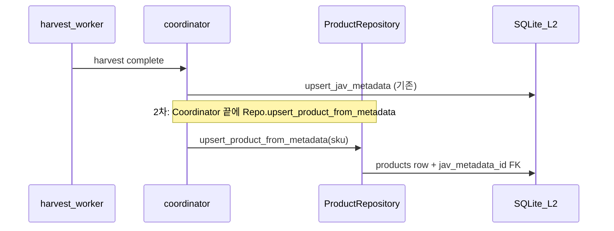
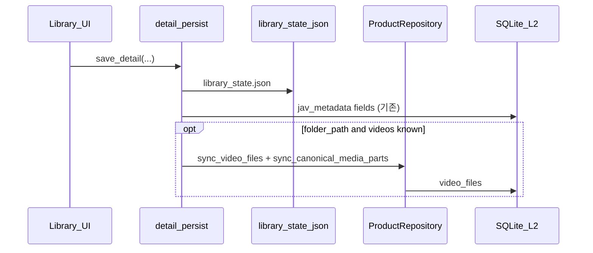

# DB v2 + Alembic 설계안

**상태**: P1–P3 구현 완료 · P4( junction / locals ) 미착수  
**구현 SoT**: 본 문서  
**참고 초안**: [db_schema_v2_proposal.md](../db_schema_v2_proposal.md) (ER 방향성만)  
**데이터 계층**: [DATA_SOT_LAYERS.md](DATA_SOT_LAYERS.md)  
**Alembic 절차**: [ALEMBIC_MILESTONE.md](ALEMBIC_MILESTONE.md)

---

## 1. 배경·목표

### 1.1 배경

- 현재 L2는 SQLite `data/db/jav_database.db`의 **`jav_metadata` 단일 테이블**이 Harvest 메타·폴더 바인딩·즐겨찾기 등을 담당한다.
- `actresses` / `genres` / `makers` 테이블은 **이미 존재**하나, `jav_metadata`와 **N:M junction이 없고** 배우·장르는 `actors_ko`, `genres_ko` 등 **TEXT**로 중복 저장된다.
- 멀티파트 영상·재생 순서는 L4 `library_state.json`의 `media.parts`가 SoT이며, L2 `folder_path`와 L1 탐색이 보조한다.
- 스키마 변경은 `javstory/harvest/database.py`의 `PRAGMA user_version`(현재 **8**)과 `_migrate_v*` 인라인 함수로 관리된다.

### 1.2 목표

| 목표 | 설명 |
|------|------|
| **정규화(부분)** | 품번(`products`)과 로컬 파일 목록(`video_files`)을 L2에 명시적으로 모델링 |
| **호환** | `jav_metadata`·`product_code` 문자열 API **유지** — 전면 교체 없음 |
| **SoT 보존** | 씬·편집·잠금 필드는 **L4 전용** — DB `scenes` 테이블 1·2차 미포함 |
| **마이그레이션 안전** | forward-only, 사용자 DB reset 금지 |
| **도구 전환** | v9+ 스키마는 **Alembic**만 사용 (`init_db` 조기 return 이후 신규 테이블은 Alembic 필수) |

### 1.3 제안서(`db_schema_v2_proposal.md`)와의 차이

| 제안서 | 본 설계 (2차) |
|--------|----------------|
| `scenes` 테이블 (video FK) | **미포함** — L4 `SceneEntry`가 SoT |
| `product_locals` 전면 이전 | **3차** — 2차는 `jav_metadata` 다국어 컬럼 유지 |
| 배우·장르 N:M | **3차** — junction + TEXT 동기화 부담 큼 |
| `video_files.absolute_path` UK | **비권장** — `video_relpath` + `folder_path` (L1 이동 대응) |
| Phase 3 일괄 이전 | **하이브리드 + hydrate** — `jav_metadata`와 병행 |

---

## 2. 현황 스냅샷 (as-is)

**소스**: [`javstory/harvest/database.py`](../javstory/harvest/database.py)  
**DB 경로**: `data/db/jav_database.db` (`javstory.config.app_config.DB_PATH`)  
**스키마 버전**: `_APP_DB_SCHEMA_VERSION = 8` → SQLite `PRAGMA user_version`

### 2.1 버전·마이그레이션 체인

| user_version | 함수 / 동작 | 내용 |
|--------------|-------------|------|
| (초기) | `create_all` + `_migrate_add_needs_review_columns` | `actresses`/`genres`/`makers`.`needs_review`; `jav_metadata`.`is_hardcoded`, `is_mopa`, `folder_path`, `actors_en` |
| 3 | `_migrate_v3_analytics_columns` | `watch_history`: `skip_count`, `session_count`, `liked`, `disliked`; `user_preferences`: `recent_score`, `time_slot` |
| 4 | `_migrate_v4_favorite_columns` | `jav_metadata`: `favorite_score`, `favorite_sources` |
| 5 | `_migrate_v5_favorite_crawl_failed_at` | `jav_metadata`: `favorite_crawl_failed_at` |
| 6 | `_migrate_v6_actress_translation_note` | `actresses`: `translation_note` |
| 7 | `_migrate_v7_favorite_score_history` | 테이블 `favorite_score_history` 생성 |
| 8 | `_migrate_v8_watch_history_part_positions` | `watch_history`: `last_positions_json` |
| (공통) | `_ensure_indexes_and_optimize` | `jav_metadata`·`favorite_score_history` 인덱스 |

**v1·v2**: 별도 `_migrate_v1`/`_migrate_v2` 함수 없음 — 초기 `create_all` + needs_review 마이그레이션에 흡수.

### 2.2 `init_db()` 동작 (버그 방지 핵심)

```text
if DB exists and user_version >= 8:
    return   # create_all·_migrate_v* 전부 스킵
else:
    create_all → _migrate_* → user_version = 8
```

**함의**: v9 이후 추가 테이블·컬럼은 **`init_db()`만으로는 기존 DB에 반영되지 않음**. 반드시 Alembic `upgrade head`(또는 동등 절차) 필요.

### 2.3 테이블·컬럼 목록 (v8)

#### `jav_metadata`

| 그룹 | 컬럼 |
|------|------|
| PK·식별 | `id`, `product_code` (UK) |
| 배우 (TEXT) | `actors_ko`, `actors_ja`, `actors_romaji`, `actors_en`, `actors_zh_cn`, `actors_zh_tw` |
| 제목 | `title_ko`, `title_ja`, `title_en`, `title_zh_cn`, `title_zh_tw`, `original_title` |
| 시놉시스 | `synopsis_ko`, `synopsis_ja`, `synopsis_en`, `synopsis_zh_cn`, `synopsis_zh_tw` |
| 장르 (TEXT) | `genres_ko`, `genres_ja`, `genres_en`, `genres_zh_cn`, `genres_zh_tw` |
| 제작사 (TEXT) | `maker_ko`, `maker_ja`, `maker_en`, `maker_zh_cn`, `maker_zh_tw` |
| 자산·상태 | `cover_image_url`, `cover_image_local_path`, `thumb_image_local_path`, `release_date`, `analysis_status`, `is_hardcoded`, `is_mopa`, `folder_path` |
| 즐겨찾기 | `favorite_score`, `favorite_sources`, `favorite_crawl_failed_at` |
| 레거시 | `title`, `synopsis`, `actors`, `genres`, `maker` |
| 타임스탬프 | `created_at`, `updated_at` |

#### 기타 테이블

| 테이블 | PK / UK | 용도 |
|--------|---------|------|
| `actresses` | `id`; `japanese` UK | 배우 사전 (번역·`translation_note`) |
| `genres` | `id`; `japanese` UK | 장르 사전 |
| `makers` | `id`; `japanese` UK | 제작사 사전 |
| `background_cache` | `product_code` PK | LLM 배경 JSON 캐시 |
| `watch_history` | `id`; `product_code` index | 시청·좋아요·파트별 위치 |
| `favorite_score_history` | `id` | 사이트 ♥ 스냅샷 시계열 |
| `user_preferences` | `id` | 배우·장르·제작사 선호도 |

**미구현 (제안서 대비)**: `products`, `video_files`, `product_locals`, `product_actresses`, `product_genres`, DB `scenes`.

### 2.4 인덱스 (v8)

- `idx_jav_metadata_updated_at`, `analysis_status`, `release_date`, `folder_path`, `favorite_score`
- `idx_fav_hist_pc_time` on `favorite_score_history(product_code, observed_at)`

---

## 3. SoT 계층 (재확인)

[DATA_SOT_LAYERS.md](DATA_SOT_LAYERS.md)와 동일. DB v2는 아래를 **깨지 않는다**.

| 계층 | SoT | DB v2 2차 영향 |
|------|-----|----------------|
| L1 | 디스크 영상·SRT·스틸 | 없음 (경로는 relpath로만 L2에 인덱스) |
| L2 | `jav_metadata` + (예정) `products`/`video_files` | **additive** |
| L3 | `{품번}_grok.json` | 없음 |
| L4 | `library_state.json` (씬·`media.parts`) | **씬 SoT 유지** — DB에 씬 테이블 없음 |

### 3.1 중복 방지 규칙

| 데이터 | 쓰기 SoT | 읽기 우선순위 |
|--------|----------|----------------|
| 품번 문자열 | L2 `product_code` / `products.sku` (동기화) | 동일 정규화: `strip().upper()`, `product_code.py` |
| 폴더 바인딩 | L2 `folder_path` (+ 2차 `products.folder_path` 미러) | L2 |
| 재생·파트 순서 | L4 `media.parts` | L4 > L2 `video_files` > L1 `video_discovery` |
| 씬·스틸·잠금 | L4 | L4 only |
| Harvest 메타(제목·시놉) | L2 `jav_metadata` (2차) | L2 |
| Grok 스토리 초안 | L3 → L4 병합 | L4 편집 우선 |

---

## 4. 목표 스키마 (to-be) — 2차

### 4.1 `products`

품번 단위 **식별·폴더 바인딩** 허브. 2차에서는 `jav_metadata`와 **1:1**.

```sql
-- 개념 DDL (Alembic revision으로 구현)
CREATE TABLE products (
    id              INTEGER PRIMARY KEY,
    sku             VARCHAR(50) NOT NULL UNIQUE,  -- product_code 정규화값
    jav_metadata_id INTEGER UNIQUE REFERENCES jav_metadata(id),
    folder_path     TEXT,
    created_at      DATETIME,
    updated_at      DATETIME
);
CREATE INDEX idx_products_folder_path ON products(folder_path);
```

| 컬럼 | 2차 채움 규칙 |
|------|----------------|
| `sku` | `jav_metadata.product_code` upper/strip |
| `jav_metadata_id` | hydrate 시 FK |
| `folder_path` | `jav_metadata.folder_path`와 **듀얼라이트** (쓰기 시 둘 다 갱신) |

**2차에 `jav_metadata`에 남기는 것**: 다국어 제목·시놉·장르 TEXT, `favorite_*`, `is_hardcoded`, `is_mopa`, 표지 URL 등 — Repository가 `jav_metadata`를 계속 primary write target으로 사용.

### 4.2 `video_files`

품번당 로컬 영상 **파트 목록** (L4 `media.parts`·L1 파일과 정렬).

```sql
CREATE TABLE video_files (
    id              INTEGER PRIMARY KEY,
    product_id      INTEGER NOT NULL REFERENCES products(id) ON DELETE CASCADE,
    part_order      INTEGER NOT NULL DEFAULT 0,
    video_relpath   TEXT NOT NULL,   -- folder_path 기준 상대 경로, '/' 구분
    duration_sec    REAL,
    file_size       INTEGER,
    fingerprint     TEXT,            -- optional: "{mtime_ns}:{size}" 등
    created_at      DATETIME,
    updated_at      DATETIME,
    UNIQUE (product_id, part_order),
    UNIQUE (product_id, video_relpath)
);
```

| 설계 결정 | 이유 |
|-----------|------|
| **절대 경로 UK 금지** | 드라이브 문자·폴더 이동 시 깨짐 |
| `part_order` | L4 `VideoPartRef.order`·`sort_video_parts`와 동일 규칙 |
| `video_relpath` | [`media_parts.build_video_part_refs`](../javstory/library/media_parts.py) 출력과 동일 형식 |

**2차에 넣지 않음**: `resolution`, `encoding_status` (제안서 항목) — 필요 시 3차.

### 4.3 2차에 의도적으로 제외

| 항목 | 사유 |
|------|------|
| DB `scenes` | L4 SoT; 이중 저장·동기화 버그 위험 |
| `product_locals` | `jav_metadata` 다국어 컬럼으로 충분 (3차) |
| `product_actresses` / `product_genres` | TEXT 파싱·backfill 부담 (3차) |
| `jav_metadata` DROP/컬럼 삭제 | 호환·회귀 위험 |

---

## 5. 데이터 흐름·듀얼라이트 (개념)

### 5.1 Repository (후속 구현)

단일 진입점 예: `javstory.harvest.product_repository` (가칭).

| 연산 | 2차 동작 |
|------|----------|
| `upsert_by_sku` | `jav_metadata` upsert → `products` upsert (FK 연결) |
| `set_folder_path` | `jav_metadata.folder_path` + `products.folder_path` |
| `sync_video_files_from_paths` | `video_files` replace-by-product → (선택) L4 `sync_canonical_media_parts` |
| `get_video_paths_for_playback` | `JAVSTORY_DB_V2_READ=1` 시 `video_files`→절대경로; else L4 parts → `video_discovery` 폴백 |

**환경변수 (가칭)**: `JAVSTORY_DB_V2_READ=0|1` — 읽기만 점진 전환, 쓰기는 항상 듀얼라이트.

### 5.2 L4 `media.parts` 동기화 규칙

1. **트리거**: 폴더 바인딩, 상세 저장 시 영상 목록 갱신, 수동 refresh  
2. **입력**: `folder_path` + `find_all_video_paths_for_product` 또는 명시 path 목록  
3. **L4**: [`sync_canonical_media_parts`](../javstory/library/media_parts.py) — `VideoPartRef` + `primary_video_relpath`  
4. **L2 (2차)**: 동일 sorted path → `video_files` rows (`part_order`, `video_relpath`)  
5. **불일치 시**: **L4 우선** (UI 편집·재생); L2는 “인덱스”로 eventual consistency (hydrate job)

### 5.3 시나리오 시퀀스

#### A. 신규 폴더 바인딩



#### B. Harvest 신규 품번



#### C. Canonical 상세 저장



---

## 6. 고영향 호출부 인벤토리 (회귀 검토)

2차까지 **공개 식별자는 `product_code` 문자열 유지**. 내부만 Repository로 교체 후보.

### Tier A — 필수 검토

| 모듈 | 역할 |
|------|------|
| [`gui/models/library_model.py`](../gui/models/library_model.py) | 목록·상세·바인딩·재생 경로 |
| [`gui/library_data.py`](../gui/library_data.py) | 요약·파이프라인 램프·정렬 |
| [`javstory/harvest/coordinator.py`](../javstory/harvest/coordinator.py) | Harvest DB 반영 |

### Tier B — 쓰기 경로

| 모듈 | 역할 |
|------|------|
| [`gui/workers/harvest_worker.py`](../gui/workers/harvest_worker.py) | Harvest 워커 |
| [`javstory/library/detail_persist.py`](../javstory/library/detail_persist.py) | 상세·canonical 저장 |
| [`gui/models/library/folder_bind.py`](../gui/models/library/folder_bind.py) | 폴더 바인딩 |
| [`api/routes/library.py`](../api/routes/library.py) | HTTP API |

### Tier C — 읽기·부가

| 모듈 | 역할 |
|------|------|
| [`javstory/analytics/library_stats.py`](../javstory/analytics/library_stats.py), [`preference_engine.py`](../javstory/analytics/preference_engine.py) | 시청·선호 |
| [`gui/models/player_model.py`](../gui/models/player_model.py) | 재생·`watch_history` |
| [`javstory/pipeline/orchestrator.py`](../javstory/pipeline/orchestrator.py) | 파이프라인 상태 |
| [`javstory/translation/subtitle_pipeline_orchestrator.py`](../javstory/translation/subtitle_pipeline_orchestrator.py) | 자막·메타 조회 |

**영향 없음 (2차)**: `watch_history.product_code`, `background_cache.product_code` — **컬럼·PK 변경 없음**.

---

## 7. 단계별 이행 로드맵

| Phase | 내용 | DB 영향 | DoD |
|-------|------|---------|-----|
| **P0** | 본 설계 문서 합의 | 없음 | 리뷰 완료 |
| **P1** | Alembic + revision `stamp_v8` (스키마 동일), `user_version=9` | stamp only | 빈 DB·v8 DB에서 upgrade 후 테이블·컬럼 목록 v8과 동일 |
| **P2** | `products`/`video_files` 테이블 + hydrate + Repository 듀얼라이트 | additive | 샘플 N품번: L4 `media.parts` order/relpath = `video_files` |
| **P3** | `JAVSTORY_DB_V2_READ` 읽기 전환, GUI 점검 | 없음 | `tests/unit` + 수동: 목록·바인딩·재생 순서 |
| **P4** | junction, `product_locals`, L4 씬 검색 인덱스(옵션) | additive | 별도 설계 |

---

## 8. 3차 로드맵 (개요)

**상태 (2026-05)**: **P4 미착수·보류** — 배우별 전 작품 필터, DB-only 씬 검색 등 **명확한 기능 요청**이 있을 때 별도 설계·착수.  
당분간 `jav_metadata` TEXT + `actresses` 테이블로 충분.

| 항목 | 내용 |
|------|------|
| `product_locals` | `jav_metadata` 다국어 컬럼 → 행 이전; view 또는 dual-read 기간 |
| `product_actresses` / `product_genres` | `actresses`/`genres`와 N:M; Harvest·수동 리뷰와 동기화 |
| `makers` FK | `products.maker_id` |
| L4 씬 검색 | **미러/FTS** only — 쓰기는 L4; `scene_search_index` (가칭) 비동기 갱신 |

---

## 9. 리스크·금지 사항

| 금지 | 이유 |
|------|------|
| `DROP TABLE jav_metadata` / DB reset | 사용자 데이터 손실 |
| DB `scenes`를 씬 SoT로 사용 | L4 `locked_fields`·스틸 경로와 충돌 |
| v9+ 테이블을 `init_db()`만으로 기대 | `user_version>=8` 조기 return |
| `video_files.absolute_path` UNIQUE | 경로 이동·E: 드라이브 |
| 2차에서 API 응답 필드명 변경 | `api/routes/library.py` breaking change |

### 9.1 버그 방지 체크리스트 (구현·QA)

- [ ] v8 DB 백업(`.bak`) 후 P1/P2 적용
- [ ] `product_code` 정규화 = [`javstory/utils/product_code.py`](../javstory/utils/product_code.py)
- [ ] Harvest 후 `products` row 누락 없음 (듀얼라이트)
- [ ] L4 없는 품번: `video_files` 비어 있어도 `guess_video_path_for_product` 폴백
- [ ] 폴더 바인딩 → L2·L4·`video_files` part_order 일치
- [ ] `tests/unit` 회귀; P2+ optional migration fixture

---

## 10. 범위 외 (본 설계 문서 기준)

- Alembic 패키지·revision 파일 추가
- SQLAlchemy `Product` / `VideoFile` 모델 코드
- `library_model` 대규모 리팩터
- CI Alembic job

**구현 착수**: P0 합의 후 별도 작업으로 P1부터 순차 진행.

---

## 변경 이력

| 날짜 | 내용 |
|------|------|
| 2026-05-16 | 초안 — P0 설계 문서 |
