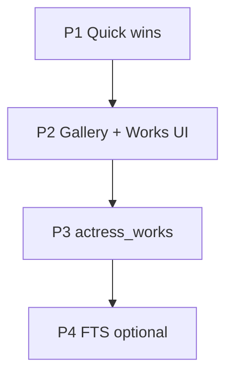

# 배우 프로필 성능 개선 — 구현 계획

작성일: 2026-06-21  
상태: **계획 (미구현)**  
관련 분석: 채팅 세션 2026-06-21 (부하 분석·제안)

---

## 배경

배우 프로필·갤러리·출연작이 채워질수록 체감 부하가 늘 수 있다.  
병목은 **배우 수**보다 **라이브러리 메타(`jav_metadata`) 규모**, **갤러리 사진 수**, **상세 화면 진입 빈도**에 더 민감하다.

### 현재 병목 요약

| 우선순위 | 이슈 | 위치 |
|----------|------|------|
| High | 상세 진입 시 `jav_metadata` **전체 스캔 2회** (출연작 + 장르) | `ActressDetailPanel.qml`, `actress_model.py`, `actress_profile.py` |
| High | 출연작 GridView **비가상화** (최대 500 포스터 동시 생성) | `ActressDetailPanel.qml` |
| High | 작품수 정렬 시 `jav_metadata` 전체 스캔 | `batch_actress_work_counts` |
| Medium | 갤러리 `load_actress_media` N+1 + 매 조회 `commit` | `actress_profile.py` |
| Medium | 갤러리 Repeater 전량 인스턴스, `sourceSize` 없음 | `ActressGallery.qml` |
| Medium | 검색 키 입력마다 전체 reload (디바운스 없음) | `ActressView.qml` |
| Medium | `updateProfile` → 목록 전체 `_refreshList` 연쇄 | `actress_model.py` |

### 이미 적용된 완화

- 작품수 정렬 → `QThread` (`_ActressWorksSortWorker`)
- 목록 aliases → SQLAlchemy `joinedload`
- 카드 썸네일 → `asynchronous` + `sourceSize` 상한
- 이미지 저장 시 PIL 리사이즈 (profile/gallery max 1200px)
- 출연작 결과 상한 500건 (`max_items`)
- WatchHistory 일괄 `IN` 조회

---

## 목표

1. **상세 화면 진입** — 메타 1만 건 기준 수 초 이내 (현재: 전체 스캔 2회)
2. **갤러리 30장+** — 프로필 로드 체감 지연 최소화
3. **작품수 정렬** — UI 프리즈 없이, 스캔 비용 감소 또는 캐시 활용
4. **확장성** — harvest·합치기·이름 수정과 동기화되는 읽기 경로 SoT 확립

---

## Phase 1 — Quick wins (예상 1주)

난이도 낮음, 회귀 리스크 낮음. **우선 착수 권장.**

### P1-01. 출연작 조회 1회화 ✅

- **문제**: `getLibraryWorks` + `getWorkGenres`가 각각 `fetch_actress_library_works` → `jav_metadata` 전체 스캔
- **구현** (2026-06-21):
  - `ActressModel.getLibraryWorksAndGenres(actress_id)` 슬롯 추가 → works + genres 한 번에 반환
  - `ActressDetailPanel.refreshWorksAndGenres()`가 단일 슬롯 사용
  - `getWorkGenres` 단독 호출 시에는 기존과 동일 (하위 호환)

### P1-02. 검색 디바운스 ✅

- **문제**: `ActressView` 검색 입력마다 `_apply_reload` + `beginResetModel`
- **구현** (2026-06-21):
  - `SearchBar` + `Timer` 400ms debounce (`MasterSearchPopup` 패턴)
  - Enter / ✕ 클릭(`accepted`) 시 타이머 중단 후 즉시 `filterList`
- **파일**: `gui/qml/views/ActressView.qml`

### P1-03. 탭 재진입 reload 스킵 ✅

- **문제**: `main.qml` 배우 탭 `onCurrentIndexChanged` → 무조건 `refreshList()`
- **구현** (2026-06-21):
  - `ActressModel.refreshListIfNeeded()` — 세션 내 **첫 방문** 또는 `_list_dirty`일 때만 갱신
  - 목록 reload 성공 시 `_list_dirty = False`; 별명 삭제 등 즉시 갱신 안 하는 변경은 `_mark_list_dirty()`
  - `refreshList()`는 강제 갱신용으로 유지
  - `ActressView.onActressModelChanged`의 중복 `refreshList` 제거
- **파일**: `gui/models/actress_model.py`, `gui/qml/main.qml`, `gui/qml/views/ActressView.qml`

### P1-04. 프로필 편집 시 목록 부분 갱신 ✅

- **문제**: `updateProfile` 성공 후 `loadProfile` + `_refresh_list` (전체)
- **구현** (2026-06-21):
  - `ActressListModel.update_item()` — 해당 행만 `dataChanged`
  - `_patch_list_item_from_current_profile()` — 상세 프로필 → 카드 1장 동기화
  - `_sync_list_after_profile_change()` — 정렬에 영향 있는 필드(이름·점수·즐겨찾기) 변경 시에만 전체 reload
  - `updateProfile` / 대표 사진 변경(`addImage`, `setProfileImage`)에 적용
- **파일**: `gui/models/actress_model.py`

---

## Phase 2 — 갤러리·출연작 UI (예상 2~3주)

### P2-01. `load_actress_media` 읽기 경로 최적화 ✅

- **문제**: 갤러리 파일마다 `filter_by` (N+1), 조회마다 `commit`
- **구현** (2026-06-21):
  - `load_actress_media(..., sync_db=False)` — 읽기 전용, `ActressImage` **일괄 조회**
  - `sync_actress_media_db()` / `sync_db=True` — 디스크↔DB 동기화 (쓰기 경로)
  - `save_actress_image`·`promote_gallery_image_to_profile` 완료 후 `sync_actress_media_db` 호출
  - `loadProfile`는 기본 읽기 전용 경로 유지
- **파일**: `javstory/utils/actress_profile.py`

### P2-02. 갤러리 썸네일 + `sourceSize` + GridView ✅

- **문제**: Repeater 전량 생성, 원본 해상도 디코딩 가능
- **구현** (2026-06-21):
  - 갤러리 저장 시 `gallery/thumb/` 256px 썸네일 생성
  - `gallery_images[]`에 `thumb_url` (그리드) / `image_url` (원본·오버레이)
  - `ActressGallery.qml`: `AppScrollView` + `GridView` (3행 뷰포트), `sourceSize` 상한
- **파일**: `javstory/utils/actress_profile.py`, `gui/models/actress_model.py`, `gui/qml/components/ActressGallery.qml`

### P2-03. 출연작 GridView 가상화 ✅

- **문제**: `interactive: false` + `height: contentHeight` → 최대 500 PosterCard 동시 생성
- **구현** (2026-06-21):
  - `_filteredWorks` SoT + `worksListModel`은 `worksPageSize`(48) 단위 페이지
  - GridView **3행 뷰포트** 고정 높이, `interactive: true`, `cacheBuffer`
  - 「더 보기」로 추가 로드 (PosterCard `sourceSize`는 기존 적용)
- **파일**: `gui/qml/components/ActressDetailPanel.qml`

### P2-04. 배우 목록 `cacheBuffer` 튜닝 ✅

- **구현** (2026-06-21): `ActressView` GridView `cacheBuffer: 320` (LibraryView와 동일)
- **파일**: `gui/qml/views/ActressView.qml`

---

## Phase 3 — 데이터 레이어 (예상 1~2개월)

근본적 확장성. harvest·재크롤·합치기·배우명 수정과 **동기화 규칙** 문서화 필수.

### P3-01. `actress_works` 연결 테이블 ✅

```text
actress_works (
  actress_id    INTEGER FK → actresses.id,
  product_code  TEXT FK → jav_metadata.product_code,
  match_source  TEXT,   -- harvest | resync | manual
  matched_token TEXT,   -- 매칭에 사용된 배우명 토큰
  updated_at    DATETIME,
  PRIMARY KEY (actress_id, product_code)
)
```

- **구현** (2026-06-21):
  - Alembic `f2a3b4c5d6e7`, `ActressWork` 모델, `user_version=14`
  - 읽기: `fetch_actress_library_works` / `batch_actress_work_counts` — 인덱스 있으면 JOIN·GROUP BY, 없으면 레거시 스캔
  - 쓰기: `coordinator` harvest commit, `resync_all_metadata`, `merge_actresses`, `add_alias` / 별명 삭제 / 이름 필드 `updateProfile`
- **파일**: `javstory/harvest/migrations/versions/f2a3b4c5d6e7_*.py`, `javstory/utils/actress_profile.py`, `javstory/harvest/coordinator.py`, `javstory/harvest/resync.py`, `gui/models/actress_model.py`
- **검증**: `tools/backfill_actress_works.py` 실행 후 상세·정렬이 레거시와 동일 (품번 집합 diff 0)

### P3-02. `actresses.work_count` 캐시 컬럼 ✅

- **구현** (2026-06-21):
  - `actresses.work_count`, `works_updated_at` + `ix_actresses_work_count` (Alembic `a1b2c3d4e5f7`, `user_version=15`)
  - P3-01 갱신 시 `refresh_actress_work_count(s)` / `refresh_all_actress_work_counts` 연동
  - `sort=works` → SQL `ORDER BY work_count` (캐시 백필 후 즉시, 레거시는 `_ActressWorksSortWorker` 폴백)
- **파일**: migration, `javstory/utils/actress_profile.py`, `gui/models/actress_model.py`, `tools/backfill_actress_works.py --counts-only`
- **검증**: 작품수 정렬 UI 프리즈 없음; 캐시 vs `actress_works` COUNT 일치

### P3-03. 백필 스크립트 ✅

- **구현** (2026-06-21): `tools/backfill_actress_works.py`
  - 기본: `rebuild_all_actress_works` + `refresh_all_actress_work_counts` + 자동 검증
  - `--verify`: 검증만 (레거시 스캔 vs `actress_works` 품번 집합·작품수·`work_count` 캐시)
  - `--counts-only`: 캐시만 갱신 | `--dry-run` | `--sample N` | `--no-verify`
  - 검증 로직: `verify_actress_works_backfill()` in `actress_profile.py`
- **검증**: `python tools/backfill_actress_works.py --verify` → VERIFY OK (품번 집합 diff 0)

---

## Phase 4 — 선택 (검색·매칭 고도화)

### P4-01. SQLite FTS5 (배우명 / actors 필드)

- ILIKE `%…%` 대체, 후보 품번 축소
- 리스크: 마이그레이션·동기화 복잡도 높음 — P3 완료 후 검토

### P4-02. 목록 페이지네이션

- 배우 수천 명 대비: `LIMIT/OFFSET` 또는 커서 기반 로드
- P1~P2로 충분하면 연기

---

## 구현 순서 (권장)



| 단계 | 항목 | 예상 기간 |
|------|------|-----------|
| 1 | P1-01 ~ P1-04 | 1주 |
| 2 | P2-01 ~ P2-03 | 2~3주 |
| 3 | P3-01 ~ P3-03 | 1~2개월 |
| 4 | P4 (선택) | 별도 |

---

## 트레이드오프·주의사항

| 결정 | 이점 | 비용 |
|------|------|------|
| `actress_works` 테이블 | 읽기 O(출연작), 정렬·상세 공통 SoT | harvest/합치기/이름 변경 시 갱신 필수 |
| `work_count` 캐시 | 정렬 즉시 | 재크롤 전 숫자 어긋날 수 있음 |
| 출연작 페이지네이션 | 메모리·렌더 절감 | 「한눈에 전체」 UX 약화 |
| ILIKE 선필터 복구 | 빠른 후보 축소 | 과거 오매칭 재발 위험 — **비권장**, P3가 안전 |

### 회귀 테스트 체크리스트

- [ ] 합친 배우 출연작 — 양쪽 이름 토큰 모두 매칭
- [ ] 재크롤 후 `actress_works` / `work_count` 일치
- [ ] 배우명·alias 수정 후 출연작 목록 갱신
- [ ] 작품수 정렬 순서가 스캔 방식과 동일
- [ ] 갤러리 추가/삭제 후 DB·디스크 일치

---

## 관련 파일 인덱스

| 영역 | 파일 |
|------|------|
| 모델 | `gui/models/actress_model.py` |
| 프로필 유틸 | `javstory/utils/actress_profile.py` |
| 목록/상세 UI | `gui/qml/views/ActressView.qml`, `gui/qml/components/ActressDetailPanel.qml` |
| 갤러리 UI | `gui/qml/components/ActressGallery.qml` |
| 카드 | `gui/qml/components/ActressProfileCard.qml` |
| 재동기화 | `javstory/harvest/resync.py` |
| harvest | `javstory/harvest/coordinator.py` |

---

## 변경 이력

| 날짜 | 내용 |
|------|------|
| 2026-06-21 | 초안 작성 (분석·제안 기반) |
