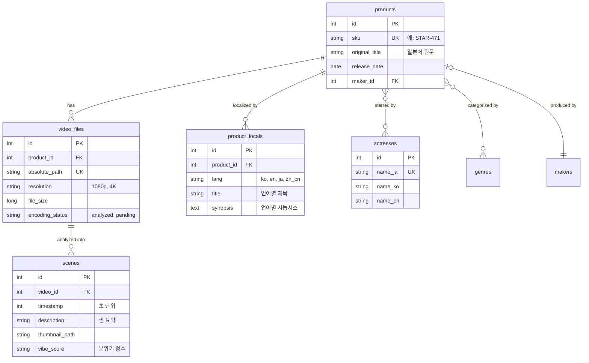

# Proposal: Singularity DB Schema v2.0 (Relational Overhaul)

> **참고용 초안** — 구현·이행 SoT는 [`DB_V2_DESIGN.md`](../DB_V2_DESIGN.md)입니다.  
> 본 문서의 `scenes` 테이블·전면 정규화는 **단계 이행하지 않으며**, 2차는 `products`/`video_files` 하이브리드·씬 SoT는 L4 `library_state.json`입니다.

현재의 단일 `jav_metadata` 테이블 방식은 초기 개발 속도는 빠르지만, 데이터가 쌓일수록 배우별 검색, 다중 파일 관리, 씬 기반 분석 등 고도화된 기능을 구현하는 데 한계가 있습니다. 이를 해결하기 위한 정규화된 2.0 스키마를 제안합니다.

## 핵심 개선 방향

1. **다채다(N:M) 관계 정규화**: 배우(Actors)와 장르(Genres)를 독립 테이블로 분리하여 검색 성능과 데이터 무결성을 확보합니다.
2. **제품(Product)과 파일(Video)의 분리**: 하나의 품번에 여러 영상 파일(예: CD1/CD2, 4K/FHD)이 존재할 수 있는 상황에 대응합니다.
3. **분석 데이터의 세분화**: 씬(Scene) 정보를 별도 테이블로 분리하여 씬별 검색 및 타임라인 탐색을 지원합니다.
4. **글로벌라이징 구조화**: 고정된 컬럼 대신 언어 코드를 기반으로 하는 번역 데이터 테이블을 고려할 수 있습니다.

---

## 제안하는 상세 스키마 구조 (Mermaid)

## 기대 효과

- **배우 기반 필터링**: 특정 배우가 출연한 모든 작품을 순식간에 조회할 수 있습니다.
- **다중 파일 관리**: 특정 품번의 영상이 여러 개 있거나 중복된 경우에도 꼬이지 않고 관리됩니다.
- **씬 탐색 기능**: Phase 4에서 구현할 "특정 상황(씬)만 골라보기" 기능의 토대가 됩니다.
- **데이터 무결성**: 제작사 이름이 오타로 인해 `S-One`과 `S1`으로 갈라지는 일을 방지합니다 (Makers 테이블 관리).

---

## 이행 전략

1. **하이브리드 모드**: 기존 `jav_metadata` 테이블을 유지하면서 새로운 테이블들을 점진적으로 추가하여 데이터를 하이드레이션(Hydration)합니다.
2. **마이그레이션**: Phase 3 완료 시점에서 기존 데이터를 새 구조로 일괄 이전하는 스크립트를 실행합니다.

---

**이 구조로 DB를 전면 개편하시겠습니까?** 아니면 현재의 단일 테이블 구조를 유지하면서 일부 필드만 보강하시겠습니까?