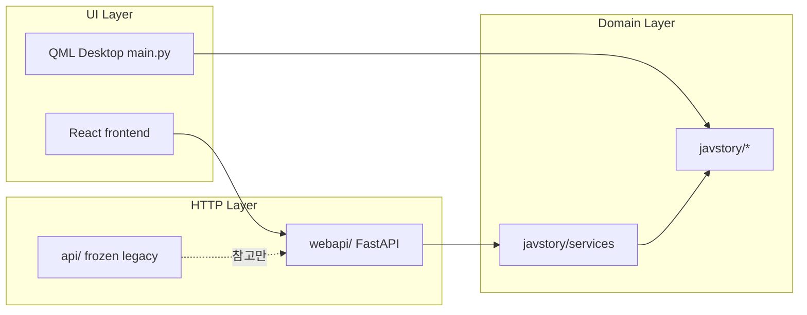

# WebUI MVP 구현 계획

> **상태**: 초안 (2026-06-27)  
> **요약**: ADR 0001에 따라 동결된 `api/`를 확장하지 않고, `javstory/` 위에 새 `webapi/` 레이어를 두어 Library·Harvest·Dashboard MVP를 React + TypeScript + Tailwind 기반 `frontend/`에 연동합니다. QML은 운영 UI로 유지하고 WebUI는 병행 진입점으로 승격합니다.

## UI 디자인 목표 (목업 기준)

**레퍼런스**: Glassmorphic 다크 대시보드 — 네온 글로우·반원 게이지·태스크 큐 테이블·Quick Actions 패널.


### 레이아웃 (App Shell)

```
┌──────────┬────────────────────────────────────────────────────┐
│ Sidebar  │ AppHeader: 제목 | 검색 | 알림 | Admin              │
│ JS       ├────────────────────────────────────────────────────┤
│ JAVSTORY │ [StatCard] [StatCard+Ring] [StatCard+Sparkline]    │
│          │ [ArcGauge CPU] [ArcGauge GPU] │ Quick Actions 2x2 │
│ Nav…     │ [Task Queue Table — status / progress / ETA]       │
│          │                                                    │
│ Profile  │                                                    │
└──────────┴────────────────────────────────────────────────────┘
```

| 영역 | 목업 요소 | 구현 파일 (신규/수정) |
|------|-----------|----------------------|
| **사이드바** | JS 로고, 활성 항목 블루 글로우, 하단 User Profile | [`NavSidebar.tsx`](../../frontend/src/components/nav/NavSidebar.tsx) — 너비·글로우 강화 |
| **헤더** | Dashboard 타이틀, 검색창, 알림 뱃지, Admin 드롭다운 | **신규** `AppHeader.tsx` — [`App.tsx`](../../frontend/src/App.tsx)에 삽입 |
| **통계 카드 (상단 3열)** | Total Library / Metadata Match Rate / Mosaic Queue | **신규** `StatCard.tsx`, `RingProgress.tsx`, `Sparkline.tsx` |
| **시스템 모니터** | CPU·GPU 반원 게이지 (i7-13700K, RTX 4070 Ti 스타일) | **신규** `ArcGauge.tsx` — SVG, `dashboard/system` API 연동 |
| **Quick Actions** | Harvest·Transcription·Mosaic·Library — 컬러 카드 + CTA 버튼 | **신규** `QuickActionGrid.tsx` — 뷰 네비게이션 + Harvest 시작 |
| **태스크 큐** | Task / Status 뱃지 / Progress bar / ETA 테이블 | **신규** `TaskQueueTable.tsx` — Harvest WS + pending 큐 |

### 비주얼 토큰 (Tailwind 확장)

기존 [`tailwind.config.js`](../../frontend/tailwind.config.js) glass 토큰 위에 **카드별 네온 액센트** 추가:

| 토큰 | 용도 | 예시 |
|------|------|------|
| `glow-blue` | Library·CPU | `shadow-[0_0_24px_rgba(59,130,246,0.25)]` |
| `glow-green` | Metadata 완료 | emerald 계열 |
| `glow-orange` | GPU·Harvest | orange 계열 |
| `glow-pink` | Mosaic 큐 | rose/pink 계열 |
| `glow-purple` | Transcription·AI | violet 계열 |

- 카드: `backdrop-blur-lg` + `border border-white/10` + 액센트별 `box-shadow`
- 활성 nav: 좌측 블루 바 + `bg-blue-500/10` 글로우 (목업과 동일)
- 배경: `#09090e` 유지, 카드 간격 `gap-4`~`gap-5`

### 네비게이션 매핑 (목업 → 기존 뷰)

MVP에서는 **뷰 ID는 유지**하고 라벨·아이콘만 목업에 맞춤:

| 목업 | 기존 `View` | MVP |
|------|-------------|-----|
| Dashboard | `dashboard` | 실 API |
| Library | `library` | 실 API |
| Actresses | `actress` | 실 API — 배우 프로필 (데스크톱 패리티) |
| Mosaic | `mosaic` | mock + "준비 중" |
| Queues | `harvest` | 실 API (수집 큐) |
| System | `dashboard` (하위 섹션) | CPU/GPU 게이지 |
| Tasks | `dashboard` (Task Queue) | Harvest·pending 연동 |
| Settings | `settings` | mock |

`processing`·`insight`는 사이드바 하단 또는 "더보기"로 유지 (목업에 없음).

### 신규 컴포넌트 목록

```
frontend/src/components/
  layout/
    AppHeader.tsx          # 검색·알림·프로필
  dashboard/
    StatCard.tsx           # 상단 KPI 카드 (icon + value + delta)
    RingProgress.tsx       # 메타데이터 매칭률 원형 링
    ArcGauge.tsx           # CPU/GPU 반원 게이지 (SVG)
    Sparkline.tsx          # 모자이크 큐 미니 차트 (SVG, recharts 없이)
    QuickActionGrid.tsx    # 2x2 액션 카드
    TaskQueueTable.tsx     # 하단 작업 테이블
  ui/
    GlowCard.tsx           # GlassCard 확장 — accent glow prop
```

**차트 라이브러리**: MVP는 **순수 SVG** (번들 최소). 2차에서 `recharts` sparkline 검토.

### DashboardView 재구성

[`DashboardView.tsx`](../../frontend/src/views/DashboardView.tsx)를 목업 그리드로 **전면 재작성**:

```tsx
// 레이아웃 구조 (의사코드)
<div className="space-y-5">
  <div className="grid grid-cols-1 lg:grid-cols-3 gap-4">
    <StatCard accent="blue" ... />      {/* library.total */}
    <RingProgress ... />                {/* metadata match % */}
    <StatCard accent="pink" sparkline /> {/* mosaic queue count */}
  </div>
  <div className="grid grid-cols-1 xl:grid-cols-3 gap-4">
    <div className="xl:col-span-2 grid grid-cols-2 gap-4">
      <ArcGauge label="CPU" ... />
      <ArcGauge label="GPU" ... />
    </div>
    <QuickActionGrid />
  </div>
  <TaskQueueTable tasks={...} />
</div>
```

데이터 소스: `GET /api/dashboard/summary`, `/system`, `/pending` + Harvest WS (`/api/harvest/ws`).

---

## 체크리스트

- [ ] ADR 0002 작성 및 ENTRYPOINTS.md / frontend README / INSTALL.md 갱신
- [ ] `javstory/services/` — library, harvest_queue, dashboard 서비스 모듈 + 단위 테스트
- [ ] `webapi/` 패키지 생성 (main, schemas, routes) + requirements-web.txt
- [ ] Library / Harvest(WS) / Dashboard 라우트 구현 및 frozen api 응답 호환 확인
- [ ] **UI Shell**: `AppHeader`, `GlowCard`, Tailwind glow 토큰, `NavSidebar` 목업 스타일
- [ ] **Dashboard 목업 구현**: `ArcGauge`, `RingProgress`, `QuickActionGrid`, `TaskQueueTable` + API 연동
- [ ] frontend: `dashboard.ts`, `VITE_API_BASE`
- [ ] start_web.bat 추가, CI webapi smoke test, 수동 E2E 체크리스트

---

## 목표

- **범위**: Library + Harvest + Dashboard (실데이터 연동)
- **아키텍처**: `javstory/` 도메인 → 새 `webapi/` (FastAPI) → [`frontend/`](../../frontend/) (React + TypeScript + Tailwind + Vite)
- **프론트 스택**: React 18, TypeScript, Tailwind CSS 3 — **기존 `frontend/` 유지·확장** (프레임워크 교체 없음)
- **유지**: QML 데스크톱 앱([`main.py`](../../main.py))은 그대로 운영 UI
- **금지**: 동결 [`api/`](../../api/) 확장·`JAVSTORY_ALLOW_FROZEN_API` 의존



---

## 1. 정책·문서 정리 (선행)

동결 스택을 “운영 WebUI”로 승격하려면 ADR 보완이 필요합니다.

- **신규** [`docs/adr/0002-webui-secondary-entrypoint.md`](../adr/0002-webui-secondary-entrypoint.md)
  - WebUI = **2차 공식 진입점** (QML과 병행, 대체 아님)
  - HTTP 경계는 `webapi/`만 사용
  - [`api/`](../../api/)는 계속 동결·삭제 검토 대상
- **갱신** [`docs/architecture/ENTRYPOINTS.md`](../architecture/ENTRYPOINTS.md), [`frontend/README.md`](../../frontend/README.md)
  - `start_web.bat` 실행법, 포트, MVP 범위 명시

---

## 2. 서비스 레이어 (`javstory/services/`)

QML 모델([`gui/models/`](../../gui/models/))과 WebAPI가 **같은 로직**을 쓰도록, HTTP 없는 순수 Python 모듈을 추가합니다. MVP에서는 QML 리팩터는 하지 않고 WebAPI가 먼저 사용합니다.

| 모듈 | 역할 | 참고 소스 |
|------|------|-----------|
| `library_service.py` | 목록·상세·표지·메타 통계 | [`api/routes/library.py`](../../api/routes/library.py) 쿼리 로직 |
| `harvest_queue_service.py` | 인메모리 Harvest 큐 + `run_crawler_for_video_path` 실행 | [`api/routes/harvest.py`](../../api/routes/harvest.py), [`javstory/harvest/coordinator.py`](../../javstory/harvest/coordinator.py) |
| `dashboard_service.py` | 라이브러리 요약 + pending 큐 + 시스템 메트릭 | [`gui/models/dashboard_model.py`](../../gui/models/dashboard_model.py), [`javstory/analytics/library_stats.py`](../../javstory/analytics/library_stats.py) |

**Dashboard API 응답 설계 (MVP)**

```python
# GET /api/dashboard/summary
{
  "library": { "total", "with_metadata", "with_folder", "without_metadata" },
  "watch": { "total", "completed", "completion_rate", "avg_rating", "total_watch_hours" },  # get_library_stats()
  "pending_count": int
}

# GET /api/dashboard/pending?limit=200
[{ "product_code", "title" }]

# GET /api/dashboard/system
{ "gpu_name", "gpu_usage_percent", "gpu_total_gb", "gpu_used_gb",
  "cpu_percent", "mem_percent", "mem_used_gb", "mem_total_gb" }

# POST /api/dashboard/pending/cancel  body: { "product_code" }
# POST /api/dashboard/pending/clear
```

표지 이미지는 기존과 동일하게 `FileResponse` + [`DATA_ROOT`/`E_DATA_ROOT`](../../javstory/config/app_config.py) 경로 검증(`_is_safe_image_path` 패턴)을 서비스/라우트에 공유합니다.

---

## 3. 새 Web API (`webapi/`)

동결 [`api/main.py`](../../api/main.py)와 **별도 패키지**로 생성합니다.

```
webapi/
  __init__.py
  main.py              # FastAPI app, CORS, lifespan
  deps.py              # DB session, optional auth hook (MVP: 없음)
  schemas/
    library.py
    harvest.py
    dashboard.py
  routes/
    library.py         # GET /api/library, /stats, /{code}, /cover/{code}
    harvest.py         # GET/POST/DELETE /api/harvest/*, WS /api/harvest/ws
    dashboard.py       # summary, pending, system, cancel/clear
```

**핵심 원칙**

- 라우트는 **얇게**: 요청 검증 → `javstory.services.*` 호출 → 스키마 반환
- 기본 포트: `8765` (`JAVSTORY_WEBAPI_PORT`로 오버라이드)
- CORS: `http://localhost:5173`, `http://127.0.0.1:5173` (환경변수 `JAVSTORY_CORS_ORIGINS` 지원)
- Harvest WebSocket 이벤트 형식은 [`frontend/src/api/harvest.ts`](../../frontend/src/api/harvest.ts)와 **호환 유지** (`state`, `progress`, `item_done` 등)

**의존성**: [`requirements-web.txt`](../../requirements-web.txt) 신규 추가

```
fastapi>=0.115,<1
uvicorn[standard]>=0.30,<1
pydantic>=2.7,<3
```

[`INSTALL.md`](../../INSTALL.md)에 `pip install -r requirements-web.txt` 단계 추가.

---

## 4. Frontend — React + TypeScript + Tailwind

동결 해제가 아니라 **운영 WebUI로 재분류**하고, MVP 3화면만 실 API에 연결합니다.

### 확정 스택

| 계층 | 기술 | 비고 |
|------|------|------|
| UI 프레임워크 | **React 18** | 기존 [`frontend/package.json`](../../frontend/package.json) |
| 언어 | **TypeScript** | API 클라이언트·뷰 타입 안전성 |
| 스타일 | **Tailwind CSS 3** | glass morphism 토큰 ([`index.css`](../../frontend/src/index.css)) |
| 빌드 | **Vite 6** | `npm run dev` / `npm run build` |
| 아이콘 | lucide-react | 기존 유지 |
| 유틸 | clsx, tailwind-merge, CVA | 기존 [`GlassCard`](../../frontend/src/components/ui/GlassCard.tsx) 등 |

**하지 않는 것 (MVP)**: Svelte/Vue 교체, MUI/Ant Design 전면 도입, shadcn/ui 대규모 마이그레이션 — 필요 시 2차에서 선택 도입.

### UI 품질 가이드 (목업 · Tailwind)

- **디자인 기준**: 상단 **「UI 디자인 목표」** 섹션 목업과 동일한 glass + neon glow
- **디자인 토큰**: `tailwind.config`에 glow-blue/green/orange/pink/purple 추가
- **컴포넌트**: `GlowCard`(GlassCard 확장), `ArcGauge`, `RingProgress`, `TaskQueueTable` 신규
- **타이포**: Inter 유지, 제목 `text-2xl font-bold`, 보조 `text-slate-400`
- **로딩**: Skeleton을 카드·게이지 형태에 맞게 커스텀
- **모션**: 카드 hover glow 강화, `ease-spring` 유지

### 4.1 API 클라이언트

- [`frontend/src/api/client.ts`](../../frontend/src/api/client.ts): `VITE_API_BASE` 환경변수 지원 (기본 `http://127.0.0.1:8765`)
- **신규** `frontend/src/api/dashboard.ts`: summary / pending / system fetch
- 기존 [`library.ts`](../../frontend/src/api/library.ts), [`harvest.ts`](../../frontend/src/api/harvest.ts): 경로 prefix 동일 유지 (`/api/library`, `/api/harvest`)

### 4.2 뷰·셸 수정

| 파일 | 작업 |
|------|------|
| [`App.tsx`](../../frontend/src/App.tsx) | `AppHeader` 추가, 메인 영역 배경·패딩 목업에 맞춤 |
| [`NavSidebar.tsx`](../../frontend/src/components/nav/NavSidebar.tsx) | 목업 nav 스타일, 하단 User Profile 블록 |
| [`DashboardView.tsx`](../../frontend/src/views/DashboardView.tsx) | **목업 레이아웃 전면 재작성** — StatCard 3열 / ArcGauge / QuickActions / TaskQueue |
| [`LibraryView.tsx`](../../frontend/src/views/LibraryView.tsx) | API 연동 유지, `GlowCard`·헤더 스타일 통일 |
| [`HarvestView.tsx`](../../frontend/src/views/HarvestView.tsx) | WS 연동 유지, UI 톤 Dashboard와 통일 |

### 4.3 MVP 외 화면 처리

Processing / Mosaic / Insight / Settings는 **mock 유지**하되, 사이드바에 “준비 중” 배지 또는 MVP 범위 밖 표시를 추가해 혼동을 줄입니다 ([`NavSidebar.tsx`](../../frontend/src/components/nav/NavSidebar.tsx)).

### 4.4 Electron

MVP는 **브라우저 + Vite dev** 우선. [`frontend/electron/main.cjs`](../../frontend/electron/main.cjs)의 `JAVSTORY_ALLOW_FROZEN_API` 의존은 제거하고 `webapi`를 기동하도록 후속 변경(선택).

---

## 5. 실행·배포 진입점

**신규** [`start_web.bat`](../../start_web.bat) (repo root):

1. venv 활성화
2. `uvicorn webapi.main:app --host 127.0.0.1 --port %JAVSTORY_WEBAPI_PORT%` (백그라운드)
3. `cd frontend && npm run dev`

개발 시 터미널 2개로 나눠 실행해도 됩니다.

```
# Terminal 1
uvicorn webapi.main:app --host 127.0.0.1 --port 8765 --reload

# Terminal 2
cd frontend && npm run dev
```

---

## 6. 테스트·CI

- **단위 테스트** `tests/unit/test_webapi_library.py`, `test_webapi_dashboard.py`
  - TestClient로 `/health`, library list/stats, dashboard summary
  - DB는 기존 pytest fixture 패턴 따름
- **CI** [`.github/workflows/ci.yml`](../../.github/workflows/ci.yml): `requirements-web.txt` 설치 + webapi import smoke (`python -c "from webapi.main import app"`)

---

## 7. 구현 순서 (권장)

1. **UI 토큰·셸**: Tailwind glow 토큰, `GlowCard`, `AppHeader`, `NavSidebar` 목업 스타일
2. **Dashboard 컴포넌트**: `ArcGauge`, `RingProgress`, `StatCard`, `QuickActionGrid`, `TaskQueueTable`
3. `javstory/services/` 3모듈 + 단위 테스트
4. `webapi/` 스켈레톤 + `/health`
5. Library / Harvest / Dashboard 라우트
6. `DashboardView` 목업 레이아웃 + `dashboard.ts` API 연동
7. Library·Harvest 뷰 스타일 통일
8. `start_web.bat`, ADR 0002, 문서 갱신
9. 수동 E2E: 목업 대비 시각 확인 + Library·Harvest·Dashboard 기능

---

## 8. MVP 이후 (범위 밖 — 참고만)

- QML 모델이 `javstory/services`를 직접 호출하도록 점진 이전 (이중 구현 제거)
- Harvest: QML의 배치·폴더 수집([`harvest_model.py`](../../gui/models/harvest_model.py)) API화
- Insight / Processing 상태 API
- LAN 원격 접속 시 인증·HTTPS
- `frontend` production build 정적 서빙 (`webapi`에서 `StaticFiles` 마운트)

---

## 리스크·주의사항

- Harvest는 **인메모리 큐**라 서버 재시작 시 큐가 사라짐 — MVP 허용, 이후 Redis/SQLite 영속화 검토
- GPU 메트릭은 `nvidia-smi` 미설치 시 `N/A` — QML과 동일 fallback
- 동결 `api/`와 `webapi/` **동시 실행 시 포트 충돌** — 문서에 webapi만 사용하도록 명시

---

## 관련 문서

- [ADR 0001 — QML 단일 스택](../adr/0001-ui-stack-qml-only.md)
- [ENTRYPOINTS.md](../architecture/ENTRYPOINTS.md)
- [frontend/README.md](../../frontend/README.md)
